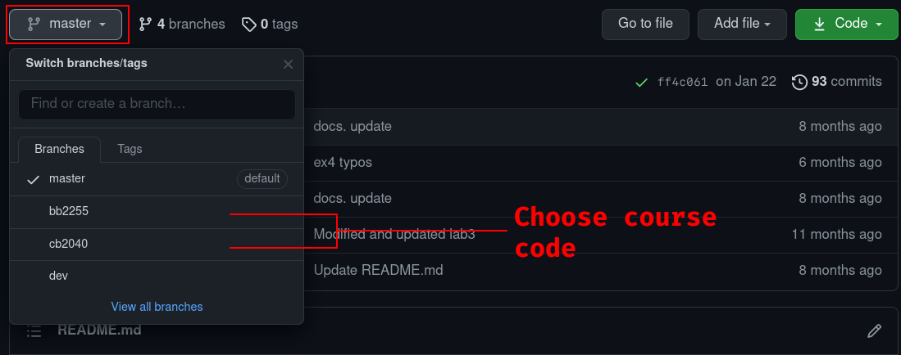
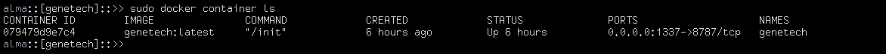

# Gene Technology Lab Course

Hello and welcome to the Gene Technology lab course landing page! This GitHub
repository contains all the instructions and material for the computer labs for
the two courses CB2040 and BB2255. Since the two aforementioned courses have a
large overlap in content we store it at the same place.

We highly recommend you to use the Docker image that we have assembled
(accessible here :
[LINK](https://hub.docker.com/repository/docker/almaand/genetech)). By using the
Docker container, you won't have to focus on installation of software packages,
dependencies, and issues with incompatibilities between different operative
systems; in short, it will make everyone's lives a lot easier.

**Note** : If you choose to _not_ use the Docker system, we will assume that you
are an experienced user both when it comes to GitHub and software management
(installation etc.), meaning that even though we _will_ help you if you have 
any problems relating to GitHub and the installation, you will be given lower
priority than those who chose the "Docker-way".

For information about the computer exercises, you need to switch from the
_master branch_ of this repository to your course specific branch. To do this,
simply find the tab on this page that says "master", click it and select the
branch that corresponds to your course code (see image below):



**Note**: read through this page before switching to your course specific page.

## Getting started with Docker and GitHub


### Installation
The very first thing you need to do is to download and install Docker.
Obviously, if you already have Docker installed, you can skip this step. Since
it's a widely used software it has good support for all operative systems (OS).
Click on the link below that best corresponds to your OS:
- Mac OS Download [LINK](https://docs.docker.com/docker-for-mac/install/)
- Windows OS Download [LINK](https://docs.docker.com/docker-for-windows/install/)
- Linux OS Download [LINK](https://docs.docker.com/engine/install/)

and follow the instructions at respective page. If you find those instructions
too technical, you'll find plenty of guides by simply googling "Install docker on
X" where X equals to your OS.

To make sure that the installation was successful, open up a terminal window and enter:

```sh
docker ps 
```

If everything went as expected, you should be able to execute this command without any
issues. If there are issues, try to troubleshoot them yourselves or ask one of
us TAs. Please note that sometimes (especially on Linux) you might have to run Docker
with `sudo` for it to work.

### Download Image
The next thing for you to do is to download the Docker _image_ that has been
created for you. You can think of this image as something similar to a CD based
game, it contains all the necessary material for you to be able to play the game
(our lab exercises) not matter what's already installed or not installed on your
computer. To get this image you'll simply pull it from DockerHub (similar to
github, but for Docker images), which you do by running the following snippet in
your terminal window:

```sh
docker pull almaand/genetech:TAG
```

Where `TAG` (at the end) should be replaced with the latest tagname listed
[here](https://hub.docker.com/repository/registry-1.docker.io/almaand/genetech/tags?page=1&ordering=last_updated).
This might take a while, but once it completed you can check that the image
download was successful by running:

```sh
docker images
```
This should list an image called `almaand/genetech` with a tag name, image ID,
creation date, and size.

### Cloning the GitHub Repository
The next thing to do is to clone this GitHub repository into a folder of your
choice. To do this, we *strongly* recommend is that you:

1. somewhere (easy accessible) on your computer create a new folder named
_genetech_.
2. Open a terminal window (or use an already opened one) an orient yourself to
   the newly created _genetech_ folder. The path to this folder will be referred
   to as `GENETECH_PATH`.
3. In the terminal, execute the following command `git clone https://github.com/almaan/genetech.git code`

### Running a Container
Now when you have a local copy of the image on your computer, the final step is
to generate a container from it. To start a container from the downloaded image
with access to the content from the cloned GitHub repository, run:

```sh
 sudo docker run -d -p 1337:8787 --name genetech -e USER='genetech' -e PASSWORD='genetech' --memory=6g --mount type=bind,source=GENETECH_PATH,target=/home/genetech -e ROOT=TRUE almaand/genetech:TAG
```

Where `GENETECH_PATH` is the path to the folder you created in the previous
step. We will allocate 6GB of memory to this lab, if your RAM memory is really small
you could change this to 4GB.

To check that your container is running, enter:

```sh
docker container ls -a
```

this will list all your containers, stopped as well as running ones, listed
there you should see something similar to (but with different ID's):



If you find a container based on the `genetech` images, you are now good to go.
Essentially what we have done is to setup a virtual operative system that you
can access via your browser; we have also customized this to run `Rstudio`
immediately for you, with all the necessary packages installed.

Now go to your favorit browser (e.g. Firefox, Safari, or Chrome) and enter:
`localhost:1337` in the address bar. This will take you to a login-page where
you should use the credentials:

- Username : genetech
- Password : genetech

### Start and Stop container
When you're not using the container, it could be a good idea to _stop_ it, so
it's not occupying resources on your computer. Likewise, if you have stopped a
container, you might also want to start it again, instead of initiating it de novo 
from the image. Commands for both these actions are given below:

- stop : `docker stop CONTAINER_ID`
- start : `docker start CONTAINER_ID`

To know which `CONTAINER_ID` to use, you can run the command `docker container
ls -a` to list all started and stopped containers.

To **remove** a container you can use the command `docker container rm
CONTAINER_ID`.

### Quick start
If you struggle setting up the docker container, we also provide a quick walkthough in this video:

[![]](https://user-images.githubusercontent.com/23736938/142621099-d2ce44a0-7a24-411f-b8b9-2f4dfc9ad457.mp4)
