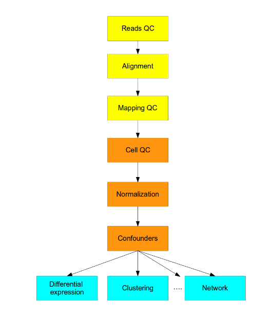

```{r setup, include=FALSE}
knitr::opts_chunk$set(echo = TRUE, eval=FALSE)
```
# Bulk RNA-seq analysis

## Introduction

For this part of the lab we are exploring RNA-seq data from mice tumors which
are treated with different kinase inhibitors. Each drug (A-F) is tested on
several mice and the tumor response is recorded (i.e. did the tumor continue to
grow above a certain threshold or not). The responses are binary classified as
"responder" and "Non_responder".


## General workflow

This is a general pipeline for a bulk RNA-seq analysis workflow:

pre-processing (yellow):
  * Check quality of raw reads and filter out reads with poor quality
  * Align reads to a reference genome (or construct a _de novo_ genome assembly if a reference is unavailable)
  * Annotate aligned reads to gene loci
  * Filter out aligned reads with poor mapping stats and remove PCR duplicates (if applicable)

quality control and normalization (orange):
  * Check quality of gene expression vectors and remove poor quality samples
  * Normalization is needed to adjust for technical variability across samples, e.g. differences in the amount of reads 
  * Adjust for other confounding factors, e.g. gender specific expression, experimental date and age 
  
analysis (blue):
  * Differential gene expression analysis, clustering and network analysis 



In this lab, we once again omit several steps and start with a count matrix of
transcripts, after alignment and mapping has been carried out. We will explore
different tools that can be used for quality control, differential gene
expression and clustering.

## Analysis pipeline

### Loading packages

The following packages should be loaded. Remember, if you haven't installed a
specific package, use `BiocManager::install("packageName")`. When running this,
you often get asked "Update all/some/none? [a/s/n]:" In general, it's ok to skip
updating the rest of the packages for this lab (which can otherwise take some
time).

```{r, message=FALSE, warning=FALSE, eval= TRUE, echo=TRUE}
library(SummarizedExperiment)
library(DESeq2)
library(pheatmap)
library(ggplot2)
library(viridis)
```

### Load the data

The data for the second lab is available from the cloned GitHub repo, found in
genetech/labs/ex2/data/.

```{r, eval= TRUE, echo=TRUE}

counts <- as.matrix(read.table("data/RNAseq_mouse_ensembl_rawCounts.csv", 
                     sep="\t", 
                     row.names = 1,
                     stringsAsFactors = F,
                     header = T))

grep <- grepl(colnames(counts), pattern="Control*")
counts <- counts[, !grep]

treatment <- sapply(strsplit(colnames(counts), "_"), "[[", 2)
outcome <- sapply(strsplit(colnames(counts), "_"), "[[", 3)
replicate <- sapply(strsplit(colnames(counts), "_"), "[[", 4)
metadata <- as.data.frame(cbind(treatment, outcome, replicate))

```

Now, you have a data frame called "metadata", with experimental information. 

### SummarizedExperiment

Create a SummarizedExpermient object with the loaded counts, call this object `se`. See
`?SummarizedExperiment` to see how to add metadata as a parameter to the
function call.

```{r, eval= TRUE, echo=TRUE}

#Write code

```

In order to extract the metadata you type e.g. `se@metadata$treatment`.
In order to extract the count data, you type `assays(se)$counts`.

### Pre-processing 

We are testing several samples for differential expression of many genes
simultaneously. This adds to the multiple testing issue, reducing the power to
detect DE (differentially expressed) genes.

Therefore, we filter out genes with all zero or low counts that does not add
anything in terms of evidence for differential expression.

Perform filtering, exlude all genes that have a total count value across all
samples of $<=10$. Use the skills you learned in Lab 1.

```{r, eval= TRUE, echo=TRUE}

#Write code

```

Now print your SummarizedExperiment object. 

```{r, eval= TRUE, echo=TRUE}

#Write code

```

### DESeq2

We will use DESeq2 for DE analysis. 

To study DE genes we *don't need* to take into an account gene length because
the tools for DE analysis are comparing the counts between sample groups for the
same gene. However, sequencing depth and RNA composition *do need* to be taken
into account.

To normalize for sequencing depth and RNA composition, DESeq2 uses
the median of ratios method. On the user-end there is only one step, but on the
back-end there are multiple steps involved, as described below.

Let's start by looking at the variability of sequencing depth across our
samples: (is normalization needed?)

Next we’ll use box plots to check the distribution of the read counts.
For convenience, we apply a log2 transformation before visual inspection of the data because the distribution is skewed towards lower values. 

```{r, eval= TRUE, echo=TRUE}

f <- assays(se)$counts
colnames(f) <- se@metadata$replicate
boxplot(log2(f + 0.5), ylab = "log (base 2) read counts + 0.5")

```


Q1 - What is your interpretation from the plot?

```{r}
# Add an answer
```

Now, in order to use the DESeq2 workflow, we first need to create a DESeq2
object to store our data. (Similar to our SummarizedExperiment). The code to do
this is given below:


```{r, warning=FALSE, message=FALSE, eval= TRUE, echo=TRUE}

#Create the DESeqDataSet (set design = ~1, which we change later)
dds <- DESeqDataSetFromMatrix(countData = assays(se)$counts,
                              colData = metadata, design = ~ 1)

#Combine factors of interest into a single factor with all combinations of the original factors
dds$group <- factor(paste0(dds$treatment,
                           dds$outcome))
design(dds) <- ~ group

```

Now, we can use the DESeq2 function `DESeq`. This is a function that performs
several steps, including normalization. The theory behind the model is explained [here](http://bioconductor.org/packages/devel/bioc/vignettes/DESeq2/inst/doc/DESeq2.html#theory)

```{r, message=FALSE, warning=FALSE, eval= TRUE, echo=TRUE}

dds <- DESeq(dds)

```

This might take a few minutes.

If you now print the `dds` object, you will see that the structure is similar to
the SummarizedExperiment, but with some new assays and colData.

```{r, eval= TRUE, echo=TRUE}
dds
```

For each sample, we now have a sizefactor (stored in colData). We can use this
sizefactor to normalize our samples by dividing the raw count with the size
factor. This is stored in `counts(dds, normalized=T)`

Make a similar boxplot as before, but with the normalized data.

```{r, eval= TRUE, echo=TRUE}
#Write code
```


Do you spot the difference?


### Exploratory analysis

When exploring RNAseq data, you usually want to perform some kind of
transformation before visualization. Otherwise, highly expressed genes tend to
dominate the result. A common method to deal with this is to simply take the
log2 of the counts (with a pseudocount added). However, this can lead to the
opposite situation - lowly expressed genes getting to much influence on the
result.

Another frequently used method is the variance-stabilizing transformation (VST),
this is used to disentangle the mean-variance relationship seen in count data.
VST is included in the DESeq2 package.


In RNA-Seq data, genes with larger mean expression tend to have higher observed
variances across samples. Random variables for which variance differ across
certain ranges of values are called "heteroscedastic". If we VST transform
the data, the standard deviation (sd) becomes more constant along the whole dynamic
range. The following picture illustrate this:


Let's transform our data via the VST method before looking at our samples:

```{r, eval= TRUE, echo=TRUE}

#Do this by using the DESeq2 function vst(), with parameter blind=FALSE and save the results to a variable called vst.data


```

#### Heatmap

Using the VST transformed counts, we can create a heatmap:

```{r, eval= TRUE, echo=TRUE, fig.height=9, fig.width=9}

sampleDists <- dist(t(assay(vst.data)))
sampleDistMatrix <- as.matrix(sampleDists)
rownames(sampleDistMatrix) <- paste(vst.data$treatment, vst.data$outcome, vst.data$replicate, sep="-")
colnames(sampleDistMatrix) <- NULL
colors <- rev(viridis(12))
pheatmap(sampleDistMatrix,
         clustering_distance_rows=sampleDists,
         clustering_distance_cols=sampleDists,
         col=colors)
```

Q2 - Is there any sample that stands out? What would you do with it?


```{r}

#Write code

```


### Differential expression

When we conduct DE analysis in this manner, we are comparing 2 conditions
against each other. As noted, we have several different conditions in this data
set, each pairwise comparison is saved as separate results in our dds object. To
view what we have:

```{r, eval= TRUE, echo=TRUE}
resultsNames(dds)
```

For example, "group_AR_vs_ANR", contains the DE result comparing Drug A
"Responder" vs Drug A "Non-responder".

A contrast is a linear combination of estimated log2 fold changes, which can be
used to test if differences between groups are equal to zero. To extract the DE
result for a specific drug, we may use results command:

```{r, eval= TRUE, echo=TRUE}

res <- results(dds, contrast=c("group", "BR", "BNR"), tidy = TRUE)

```

Note that the log2 fold change and Wald test p-values will be for the last
variable. (See [this
link](https://www.statisticshowto.datasciencecentral.com/wald-test/) for an
explanation on the Wald test.)

NOTE: The genes with adjusted p-values of NA have less mean normalized counts
than the optimal threshold.

Now, use this method to find the top 50 upregulated and downregulated genes
(based on adjusted p-value) for each specific drug, i.e. for drug A -> compare
responders vs non-responders. Do this for all drugs and create a list of the
genes.


```{r, eval= TRUE, echo=TRUE}
#Write code
```


Q3 - Is there any overlap between these genes across drugs? Are there some genes
that seem to correlate with all responders regardless of drug? Is there any drug
with a specific set of genes?

Hint: the function `intersect()` could be useful

```{r, eval= TRUE, echo=TRUE}
# Add answer
```

Q4 - Take one or two genes and look it up. Can you make any conclusion? Motivate your finding!

```{r}
# Add answer
```


# Genome wide assiciation study - GWAS

## Lab info 

We will will use the data from Saw et.al (2017) to illustrate the genome-wide association studies (GWAS). We will map the genetic determinants of 
cholesterol levels within three Southeast Asian populations. 

In this part of the lab we will give you the output of the R code directly. Instead the focus is to understand what type of data one could get out 
of variant calling and genome-wide association studies (GWAS). The data for the GWAS part is available here: https://github.com/monogenea/GWAStutorial. 
If you want to run the code (*not required*), just copy the whole repo to the "../genetech/labs/ex2/data" and run it from there. 

Use the provided template to answer the questions! 

### What is GWAS?

Genome-wide association (GWA) studies scan an entire species genome for association between up to millions of SNPs/indels and a given trait of interest. 
Notably, the trait of interest can be virtually any sort of phenotype ascribed to the population, be it qualitative (e.g. disease status) or 
quantitative (e.g. height). 

Essentially, given p SNPs and n samples or individuals, a common method is to fit p linear models, each based on n samples, using the genotype of each SNP as predictor of the trait of interest. GWAS can be univariate or multivariate depending how many traits are being studied. 
The significance of association (P-value) in each of the p tests is determined from the coefficient estimate $\beta_{i}$  of the corresponding SNP (technically speaking, the significance of association is $P(\beta_{i}|H_0: \beta_{i}=0)$ ). Since we are testing multiple SNP's it's necessary to adjust the resulting P-values using multiple hypothesis testing (MHT) methods such as Bonferroni, Benjamini-Hochberg or false discovery rate (FDR).


### Data

Data is from Saw et.al (2017): https://www.nature.com/articles/s41467-017-00413-x.

There is a mixed population of 316 Chinese, Indian and Malay in the study. These individuals were characterized using high-throughput SNP-chip sequencing, transcriptomics and lipidomics. In this data, we have >2.5 million SNP markers as well as cholesterol levels which we will search for associations with.

### General workflow

These steps have already been executed (i.e., you do not have to do them), but to get the overall picture -> 


#### Steps after SNP calling

```{r, eval=FALSE, echo=FALSE}

#The following packages should be loaded. Remember, if you havn't installed a specific package, use `BiocManager::install("packageName")`. When running this, you often get asked "Update all/some/none? [a/s/n]:" In general, it's ok to skip updating the rest of the packages for this lab (which can otherwise take some time). 

library(ggbio)
library(GenomicRanges)
library(snpStats)
library(SNPRelate)
library(dplyr)
```

```{r, eval=FALSE, echo=FALSE}

#you don't have to run the code!

#Loading the SNP data
load("data/GWAStutorial/conversionTable.RData")
 
pathM <- paste("data/GWAStutorial/public/Genomics/108Malay_2527458snps", c(".bed", ".bim", ".fam"), sep = "")
SNP_M <- read.plink(pathM[1], pathM[2], pathM[3])
 
pathI <- paste("data/GWAStutorial/public/Genomics/105Indian_2527458snps", c(".bed", ".bim", ".fam"), sep = "")
SNP_I <- read.plink(pathI[1], pathI[2], pathI[3])
 
pathC <- paste("data/GWAStutorial/public/Genomics/110Chinese_2527458snps", c(".bed", ".bim", ".fam"), sep = "")
SNP_C <- read.plink(pathC[1], pathC[2], pathC[3])
 
# Merge the three SNP datasets
SNP <- SNP_M
SNP$genotypes <- rbind(SNP_M$genotypes, SNP_I$genotypes, SNP_C$genotypes)
colnames(SNP$map) <- c("chr", "SNP", "gen.dist", "position", "A1", "A2") # all 3 maps are based on the same ordered set of SNPs
SNP$fam<- rbind(SNP_M$fam, SNP_I$fam, SNP_C$fam)

# Rename SNPs present in the conversion table into rs IDs
mappedSNPs <- intersect(SNP$map$SNP, names(conversionTable))
newIDs <- conversionTable[match(SNP$map$SNP[SNP$map$SNP %in% mappedSNPs], names(conversionTable))]
SNP$map$SNP[rownames(SNP$map) %in% mappedSNPs] <- newIDs
```

So, lets start where the SNPs are already called. We also have some metadata along with our samples (lipid measurements on each patient and their country). We lack all info on some of the samples, so we only keep complete cases (a quite common solution). 

```{r, eval=FALSE, echo=FALSE}

# Load lipid datasets & match SNP-Lipidomics samples
lipidsMalay <- read.delim("data/GWAStutorial/public/Lipidomic/117Malay_282lipids.txt", row.names = 1)
lipidsIndian <- read.delim("data/GWAStutorial/public/Lipidomic/120Indian_282lipids.txt", row.names = 1)
lipidsChinese <- read.delim("data/GWAStutorial/public/Lipidomic/122Chinese_282lipids.txt", row.names = 1)

all(Reduce(intersect, list(colnames(lipidsMalay),
  colnames(lipidsIndian),
  colnames(lipidsChinese))) == colnames(lipidsMalay)) # TRUE
lip <- rbind(lipidsMalay, lipidsIndian, lipidsChinese)
 
# Add country information
country <- sapply(list(SNP_M, SNP_I, SNP_C), function(k){
  nrow(k$genotypes)
})
origin <- data.frame(sample.id = rownames(SNP$genotypes),
                     Country = factor(rep(c("M", "I", "C"), country)))

matchingSamples <- intersect(rownames(lip), rownames(SNP$genotypes))
SNP$genotypes <- SNP$genotypes[matchingSamples,]
lip <- lip[matchingSamples,]
origin <- origin[match(matchingSamples, origin$sample.id),]

# Combine SNP and Lipidomics
genData <- list(SNP = SNP$genotype, MAP = SNP$map, LIP = lip)

# Write processed omics and GDS
save(genData, origin, file = "data/GWAStutorial/PhenoGenoMap.RData")
write.plink("data/GWAStutorial/convertGDS", snps = SNP$genotypes)
 
# Clear memory
rm(list = ls())

```

#### Pre-processing

Since we are working with a huge dataset, it would be in order to conduct some filtering prior to analysis. Let us:
- discarding SNPs with call rate < 1  or  Minor-allele frequency (MAF) < 0.1
- discarding samples with call rate < 100%, IBD kinship coefficient > 0.1 or inbreeding coefficient |F| > 0.1

Again, this is already made for you... Just keep in mind that various filtering steps are usually conducted to limit the size of the data, both for computational and statistical reasons. 

```{r, eval=FALSE, echo=FALSE}
#Linux/macOS installation of GenABEL:
#install.packages("GenABEL.data", repos="http://R-Forge.R-project.org")
#packageurl <- "https://cran.r-project.org/src/contrib/Archive/GenABEL/GenABEL_1.8-0.tar.gz"
#install.packages(packageurl, repos=NULL)
#for(pkg in c("snpStats", "doParallel", "SNPRelate", "GenABEL")){
#  if(!require(pkg, character.only = T)) {
#    stop("At least one pckg is required for this script. Please install it on your system.")
#  }
#}

source("data/GWAStutorial/GWASfunction.R")
load("data/GWAStutorial/PhenoGenoMap.RData")
 
# Use SNP call rate of 100%, MAF of 0.1 (very stringent)
maf <- 0.1
callRate <- 1
SNPstats <- col.summary(genData$SNP)
 
maf_call <- with(SNPstats, MAF > maf & Call.rate == callRate)
genData$SNP <- genData$SNP[,maf_call]
genData$MAP <- genData$MAP[maf_call,]
SNPstats <- SNPstats[maf_call,]

# Sample call rate & heterozygosity
callMat <- !is.na(genData$SNP)
Sampstats <- row.summary(genData$SNP)
hetExp <- callMat %*% (2 * SNPstats$MAF * (1 - SNPstats$MAF)) # Hardy-Weinberg heterozygosity (expected)
hetObs <- with(Sampstats, Heterozygosity * (ncol(genData$SNP)) * Call.rate)
Sampstats$hetF <- 1-(hetObs/hetExp)
# Use sample call rate of 100%, het threshold of 0.1 (very stringent)
het <- 0.1 # Set cutoff for inbreeding coefficient;
het_call <- with(Sampstats, abs(hetF) < het & Call.rate == 1)
genData$SNP <- genData$SNP[het_call,]
genData$LIP <- genData$LIP[het_call,]

# LD and kinship coeff
ld <- .2
kin <- .1
snpgdsBED2GDS(bed.fn = "data/GWAStutorial/convertGDS.bed", 
              bim.fn = "data/GWAStutorial/convertGDS.bim",
              fam.fn = "data/GWAStutorial/convertGDS.fam", 
              out.gdsfn = "myGDS", 
              cvt.chr = "char")
genofile <- snpgdsOpen("myGDS", readonly = F)
gds.ids <- read.gdsn(index.gdsn(genofile, "sample.id"))
gds.ids <- sub("-1", "", gds.ids)
add.gdsn(genofile, "sample.id", gds.ids, replace = T)
geno.sample.ids <- rownames(genData$SNP)
# First filter for LD
snpSUB <- snpgdsLDpruning(genofile, ld.threshold = ld,
                          sample.id = geno.sample.ids,
                          snp.id = colnames(genData$SNP))
snpset.ibd <- unlist(snpSUB, use.names = F)
# And now filter for MoM
ibd <- snpgdsIBDMoM(genofile, kinship = T,
                    sample.id = geno.sample.ids,
                    snp.id = snpset.ibd,
                    num.thread = 1)
ibdcoef <- snpgdsIBDSelection(ibd)
ibdcoef <- ibdcoef[ibdcoef$kinship >= kin,]
 
# Filter samples out
related.samples <- NULL
while (nrow(ibdcoef) > 0) {
  # count the number of occurrences of each and take the top one
  sample.counts <- arrange(count(c(ibdcoef$ID1, ibdcoef$ID2)), -freq)
  rm.sample <- sample.counts[1, 'x']
  cat("Removing sample", as.character(rm.sample), 'too closely related to', sample.counts[1, 'freq'],'other samples.\n')
  
  # remove from ibdcoef and add to list
  ibdcoef <- ibdcoef[ibdcoef$ID1 != rm.sample & ibdcoef$ID2 != rm.sample,]
  related.samples <- c(as.character(rm.sample), related.samples)
}

genData$SNP <- genData$SNP[!(rownames(genData$SNP) %in% related.samples),]
genData$LIP <- genData$LIP[!(rownames(genData$LIP) %in% related.samples),]

```

### Analysis

#### Principal component analysis (PCA)

Let's use a standard go-to visualization method for high dimensional data as an exploratory look of our samples. 


```{r, eval=FALSE, echo=FALSE}
# PCA

# set random seed for reproducibility
set.seed(100)

# conduct pca
pca <- snpgdsPCA(genofile, sample.id = geno.sample.ids, 
                 snp.id = snpset.ibd, num.thread = 1)

# construct dataframe with the two first PC's
pctab <- data.frame(sample.id = pca$sample.id,
                    PC1 = pca$eigenvect[,1],
                    PC2 = pca$eigenvect[,2],
                    stringsAsFactors = F)

# Subset and/or reorder origin accordingly
origin <- origin[match(pca$sample.id, origin$sample.id),]

pcaCol <- rep(rgb(0,0,0,.3), length(pca$sample.id)) # Set black for chinese
pcaCol[origin$Country == "I"] <- rgb(1,0,0,.3) # red for indian
pcaCol[origin$Country == "M"] <- rgb(0,.7,0,.3) # green for malay

png("PCApopulation.png", width = 500, height = 500)
plot(pctab$PC1, pctab$PC2, xlab = "PC1", ylab = "PC2", col = pcaCol, pch = 16)
abline(h = 0, v = 0, lty = 2, col = "grey")
legend("top", legend = c("Chinese", "Indian", "Malay"), col = 1:3, pch = 16, bty = "n")
dev.off()

```


Q1: Explain the result

```{r, eval=FALSE, echo=TRUE}


#Add answer here


```

#### GWAS

Let's now perform our GWAS study. In the information we have 282 different lipids, lets choose to make the cholesterol levels our target of interest. 

```{r, eval=FALSE, echo=TRUE}
# Choose trait for association analysis, use colnames(genData$LIP) for listing
# NOTE: Ignore the first column of genData$LIP (gender)
target <- "Cholesterol"
 
phenodata <- data.frame("id" = rownames(genData$LIP),
                        "phenotype" = scale(genData$LIP[,target]), 
                        stringsAsFactors = F)
 
# Conduct GWAS (will take a long while)

#If the GWAA command doesn't work, uncomment:
#library(rstudioapi)
#if (Sys.getenv("RSTUDIO") == "1" && !nzchar(Sys.getenv("RSTUDIO_TERM")) && 
#    Sys.info()["sysname"] == "Darwin" && getRversion() >= "4.0.0") {
#  if(versionInfo()$version < "1.3.1056"){
#    parallel:::setDefaultClusterOptions(setup_strategy = "sequential")
#  }  
#}

start <- Sys.time()
GWAA(genodata = genData$SNP, phenodata = phenodata, filename = paste(target, ".txt", sep = ""))
Sys.time() - start # benchmark
```

For visualization of our results, we will use a "Manhattan plot". 

```{r, eval=FALSE, echo=TRUE}
# Manhattan plot
GWASout <- read.table(paste(target, ".txt", sep = ""), header = T, 
                      colClasses = c("character", rep("numeric",4)))
GWASout$type <- rep("typed", nrow(GWASout))
GWASout$Neg_logP <- -log10(GWASout$p.value)
GWASout <- merge(GWASout, genData$MAP[,c("SNP", "chr", "position")])
GWASout <- GWASout[order(GWASout$Neg_logP, decreasing = T),]
 
png(paste(target, ".png", sep = ""), height = 500,width = 1000)
GWAS_Manhattan(GWASout)
dev.off()
```


Q2: How many significant SNPs do you see when the significance level of $5x10^{-6}$ is used? And if so, what chromosomes are those on?

```{r, eval=FALSE, echo=TRUE}


#Add answer here


```


Lets also include a little sanity check of our result by using a Q-Q plot. Here, we contrast the distribution of the resulting p-values against those expected by chance. If the two are identical, we get a x=y line. If our method to obtain our result is sound, we should in theory get a x=y line with a few deviating values suggestive of association. Otherwise, we might have confounding factors that cause problems for our approach. 

```{r, eval=FALSE, echo=FALSE}

# QQ plot using GenABEL estlambda function
png(paste(target, "_QQplot.png", sep = ""), width = 500, height = 500)
lambda <- estlambda(GWASout$t.value**2, plot = T, method = "median")
dev.off()

```


Q3: What is your interpretation of the Q-Q plot?

```{r, eval=FALSE, echo=FALSE}


#Add answer here


```


### Functional interpretation

Each SNP is identified via an ID, lets take a look at the identified significant variants. You can search e.g https://www.ncbi.nlm.nih.gov/snp/ with this ID as input to find out information about the variant. 

Q4: Is there any variant that are within a gene? Can you find any potential biological association of interest with regards to cholesterol? 

```{r, eval=FALSE, echo=TRUE}


#Add answer here

```

## Acknowledgement 

The GWAS tutorial is adapted from GWAStutorial by Francisco Lima. 
