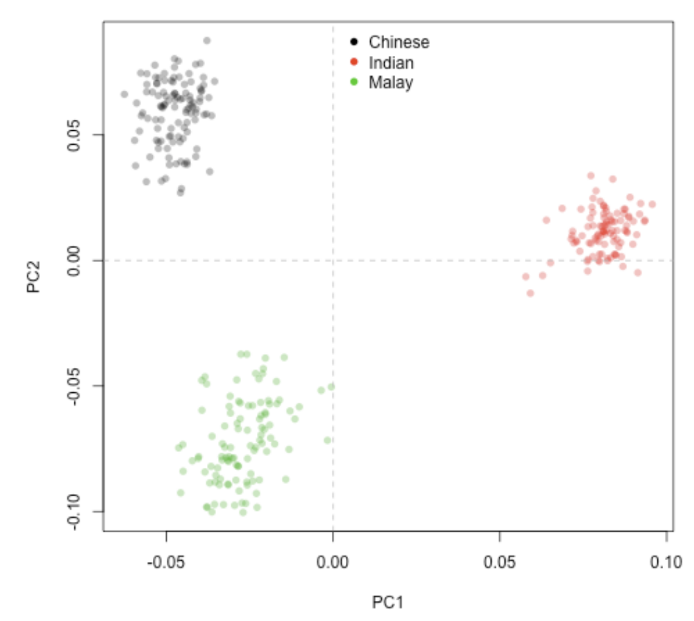
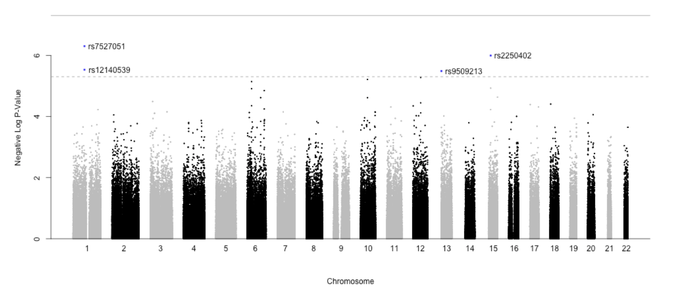
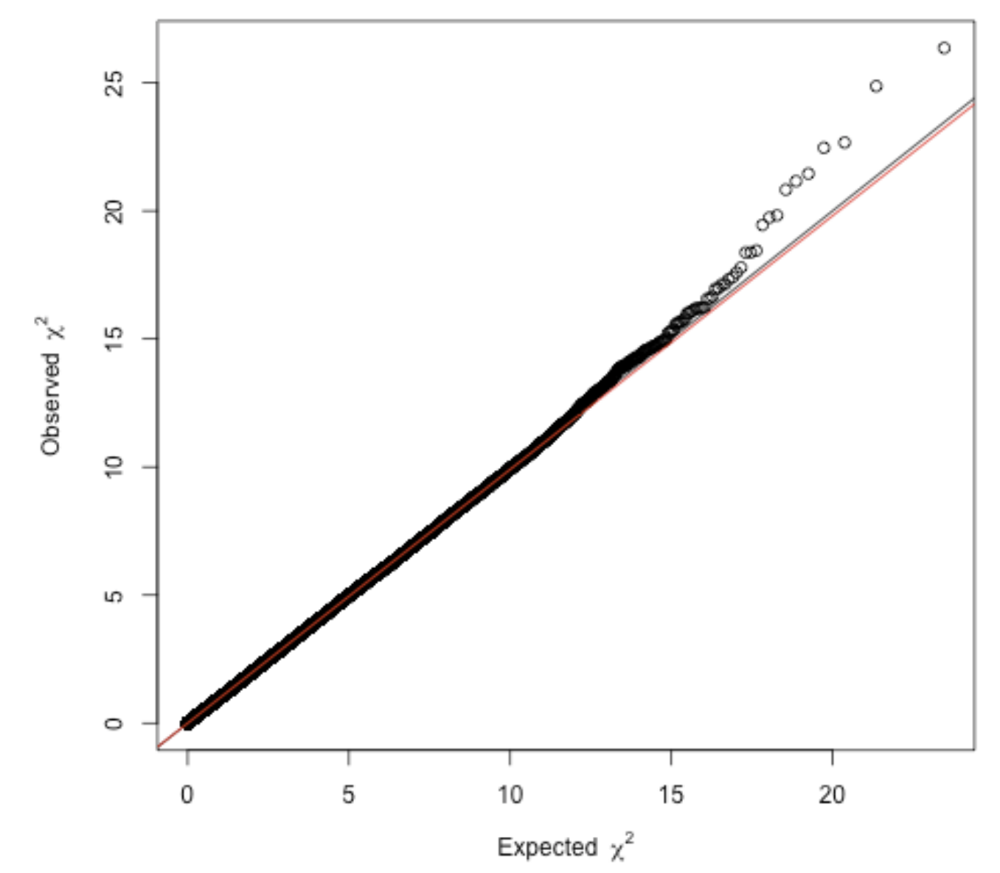

```{r setup, include=FALSE}
knitr::opts_chunk$set(echo = TRUE)
```

```{r, eval=FALSE, echo=FALSE}

#The following packages should be loaded. Remember, if you havn't installed a specific package, use `BiocManager::install("packageName")`. When running this, you often get asked "Update all/some/none? [a/s/n]:" In general, it's ok to skip updating the rest of the packages for this lab (which can otherwise take some time). 

library(ggbio)
library(GenomicRanges)
library(snpStats)
library(SNPRelate)
library(dplyr)
```


# Lab info 

Illustration of genome-wide association studies (GWAS) by mapping the genetic determinants of cholesterol levels within three Southeast Asian populations.

In this first part of the lab, we will just give you the output of the R code directly. Instead focus is to understand what type of data that one could get out of variant analysis / GWAS. 

Use the provided template to answer the questions !

## GWAS?

Genome-wide association (GWA) studies scan an entire species genome for association between up to millions of SNPs and a given trait of interest. Notably, the trait of interest can be virtually any sort of phenotype ascribed to the population, be it qualitative (e.g. disease status) or quantitative (e.g. height). Essentially, given p SNPs and n samples or individuals, a GWAS will fit p independent univariate linear models, each based on n samples, using the genotype of each SNP as predictor of the trait of interest. The significance of association (P-value) in each of the p tests is determined from the coefficient estimate \beta  of the corresponding SNP (technically speaking, the significance of association is P(\beta|H_0: \beta=0) ). It's necessary to adjust the resulting P-values using multiple hypothesis testing methods such as Bonferroni, Benjamini-Hochberg or false discovery rate (FDR).

## Data

A mixed population of 316 Chinese, Indian and Malay that was characterized using high-throughput SNP-chip sequencing, transcriptomics and lipidomics. In this data, we have >2.5 million SNP markers as well as cholesterol levels which we will search for associations.

You can find the study here -> https://www.nature.com/articles/s41467-017-00413-x

## General workflow

These steps are already made for you, but to get the overall picture -> 


### After SNPs are called

```{r, eval=FALSE, echo=FALSE}
load("data/GWAS/GWAStutorial/conversionTable.RData")
 
pathM <- paste("data/GWAS/GWAStutorial/public/Genomics/108Malay_2527458snps", c(".bed", ".bim", ".fam"), sep = "")
SNP_M <- read.plink(pathM[1], pathM[2], pathM[3])
 
pathI <- paste("data/GWAS/GWAStutorial/public/Genomics/105Indian_2527458snps", c(".bed", ".bim", ".fam"), sep = "")
SNP_I <- read.plink(pathI[1], pathI[2], pathI[3])
 
pathC <- paste("data/GWAS/GWAStutorial/public/Genomics/110Chinese_2527458snps", c(".bed", ".bim", ".fam"), sep = "")
SNP_C <- read.plink(pathC[1], pathC[2], pathC[3])
 
# Merge the three SNP datasets
SNP <- rbind(SNP_M$genotypes, SNP_I$genotypes, SNP_C$genotypes)
 
# Take one bim map (all 3 maps are based on the same ordered set of SNPs)
map <- SNP_M$map
colnames(map) <- c("chr", "SNP", "gen.dist", "position", "A1", "A2")
 
# Rename SNPs present in the conversion table into rs IDs
mappedSNPs <- intersect(map$SNP, names(conversionTable))
newIDs <- conversionTable[match(map$SNP[map$SNP %in% mappedSNPs], names(conversionTable))]
map$SNP[rownames(map) %in% mappedSNPs] <- newIDs

```

So, lets start where the SNPs are already called. We also have some meta data along with our samples (lipid measurements on each patient). We lack all info on some of the samples, so we only keep complete cases (a quite common situation..). 

```{r, eval=FALSE, echo=FALSE}

# Load lipid datasets & match SNP-Lipidomics samples
lipidsMalay <- read.delim("data/GWAS/GWAStutorial/public/Lipidomic/117Malay_282lipids.txt", row.names = 1)
lipidsIndian <- read.delim("data/GWAS/GWAStutorial/public/Lipidomic/120Indian_282lipids.txt", row.names = 1)
lipidsChinese <- read.delim("data/GWAS/GWAStutorial/public/Lipidomic/122Chinese_282lipids.txt", row.names = 1)
all(Reduce(intersect, list(colnames(lipidsMalay),
colnames(lipidsIndian),
colnames(lipidsChinese))) == colnames(lipidsMalay)) # TRUE
lip <- rbind(lipidsMalay, lipidsIndian, lipidsChinese)
 
matchingSamples <- intersect(rownames(lip), rownames(SNP))
SNP <- SNP[matchingSamples,]
lip <- lip[matchingSamples,]
 
genData <- list(SNP = SNP, MAP = map, LIP = lip)
save(genData, file = "data/GWAS/GWAStutorial/PhenoGenoMap.RData")
 
# Clear memory
rm(list = ls())

```

### Pre-processing

Since we are working with huge date, it would be in order to conduct some filtering prior to analysis. Lets:
- discarding SNPs with call rate < 1  or  Minor-allele frequency (MAF) < 0.1
- discarding samples with call rate < 100%, IBD kinship coefficient > 0.1 or inbreeding coefficient |F| > 0.1

Again, this is already made for you.. Just keep in mind that various filtering steps are usually conducted to limit the size of the data, both for computational and statistical reasons. 

```{r, eval=FALSE, echo=FALSE}
#Linux/macOS installation of GenABEL:
#install.packages("GenABEL.data", repos="http://R-Forge.R-project.org")
#packageurl <- "https://cran.r-project.org/src/contrib/Archive/GenABEL/GenABEL_1.8-0.tar.gz"
#install.packages(packageurl, repos=NULL)

  source("data/GWAS/GWAStutorial/GWASfunction.R")
load("data/GWAS/GWAStutorial/PhenoGenoMap.RData")
 
# Use SNP call rate of 100%, MAF of 0.1 (very stringent)
maf <- 0.1
callRate <- 1
SNPstats <- col.summary(genData$SNP)
 
maf_call <- with(SNPstats, MAF > maf & Call.rate == callRate)
genData$SNP <- genData$SNP[,maf_call]
genData$MAP <- genData$MAP[maf_call,]
SNPstats <- SNPstats[maf_call,]

# Sample call rate & heterozygosity
callMat <- !is.na(genData$SNP)
Sampstats <- row.summary(genData$SNP)
hetExp <- callMat %*% (2 * SNPstats$MAF * (1 - SNPstats$MAF)) # Hardy-Weinberg heterozygosity (expected)
hetObs <- with(Sampstats, Heterozygosity * (ncol(genData$SNP)) * Call.rate)
Sampstats$hetF <- 1-(hetObs/hetExp)
# Use sample call rate of 100%, het threshold of 0.1 (very stringent)
het <- 0.1 # Set cutoff for inbreeding coefficient;
het_call <- with(Sampstats, abs(hetF) < het & Call.rate == 1)
genData$SNP <- genData$SNP[het_call,]
genData$LIP <- genData$LIP[het_call,]

# LD and kinship coeff
ld <- .2
kin <- .1
snpgdsBED2GDS(bed.fn = "data/GWAS/GWAStutorial/convertGDS.bed", bim.fn = "data/GWAS/GWAStutorial/convertGDS.bim",
fam.fn = "data/GWAS/GWAStutorial/convertGDS.fam", out.gdsfn = "myGDS", cvt.chr = "char")
genofile <- snpgdsOpen("myGDS", readonly = F)
gds.ids <- read.gdsn(index.gdsn(genofile, "sample.id"))
gds.ids <- sub("-1", "", gds.ids)
add.gdsn(genofile, "sample.id", gds.ids, replace = T)
geno.sample.ids <- rownames(genData$SNP)
# First filter for LD
snpSUB <- snpgdsLDpruning(genofile, ld.threshold = ld,
sample.id = geno.sample.ids,
snp.id = colnames(genData$SNP))
snpset.ibd <- unlist(snpSUB, use.names = F)
# And now filter for MoM
ibd <- snpgdsIBDMoM(genofile, kinship = T,
sample.id = geno.sample.ids,
snp.id = snpset.ibd,
num.thread = 1)
ibdcoef <- snpgdsIBDSelection(ibd)
ibdcoef <- ibdcoef[ibdcoef$kinship >= kin,]
 
# Filter samples out
related.samples <- NULL
while (nrow(ibdcoef) > 0) {
# count the number of occurrences of each and take the top one
sample.counts <- arrange(count(c(ibdcoef$ID1, ibdcoef$ID2)), -freq)
rm.sample <- sample.counts[1, 'x']
cat("Removing sample", as.character(rm.sample), 'too closely related to', sample.counts[1, 'freq'],'other samples.\n')
 
# remove from ibdcoef and add to list
ibdcoef <- ibdcoef[ibdcoef$ID1 != rm.sample & ibdcoef$ID2 != rm.sample,]
related.samples <- c(as.character(rm.sample), related.samples)
}
genData$SNP <- genData$SNP[!(rownames(genData$SNP) %in% related.samples),]
genData$LIP <- genData$LIP[!(rownames(genData$LIP) %in% related.samples),]

```

## Analysis

### PCA

Lets use a standard go-to visualization method for high dimensional data as an exploratory look of our samples. 

```{r, eval=FALSE, echo=FALSE}
# PCA
pca <- snpgdsPCA(genofile, sample.id = geno.sample.ids, snp.id = snpset.ibd, num.thread = 1)
pctab <- data.frame(sample.id = pca$sample.id,
PC1 = pca$eigenvect[,1],
PC2 = pca$eigenvect[,2],
stringsAsFactors = F)
 
origin <- read.delim("data/GWAS/GWAStutorial/countryOrigin.txt", sep = "\t")
origin <- origin[match(pca$sample.id, origin$sample.id),]
 
pcaCol <- rep(rgb(0,0,0,.3), length(pca$sample.id)) # Set black for chinese
pcaCol[origin$Country == "I"] <- rgb(1,0,0,.3) # red for indian
pcaCol[origin$Country == "M"] <- rgb(0,.7,0,.3) # green for malay
 
png("PCApopulation.png", width = 500, height = 500)
plot(pctab$PC1, pctab$PC2, xlab = "PC1", ylab = "PC2", col = pcaCol, pch = 16)
abline(h = 0, v = 0, lty = 2, col = "grey")
legend("top", legend = c("Chinese", "Indian", "Malay"), col = 1:3, pch = 16, bty = "n")
dev.off()

```




Q1: Explain the result

```{r, eval=FALSE, echo=TRUE}


#Add answer here


```

### GWAS

Let's now perform our GWAS study. In the information we have 282 different lipids, lets choose to make the cholesterol levels our target of interest. 

```{r, eval=FALSE, echo=TRUE}
# Choose trait for association analysis, use colnames(genData$LIP) for listing
# NOTE: Ignore the first column of genData$LIP (gender)
target <- "Cholesterol"
 
phenodata <- data.frame("id" = rownames(genData$LIP),
"phenotype" = scale(genData$LIP[,target]), stringsAsFactors = F)
 
# Conduct GWAS (will take a while)
start <- Sys.time()
GWAA(genodata = genData$SNP, phenodata = phenodata, filename = paste(target, ".txt", sep = ""))
Sys.time() - start # benchmark
```

For visualization of our results, we will use a "Manhattan plot". 

```{r, eval=FALSE, echo=TRUE}
# Manhattan plot
GWASout <- read.table(paste(target, ".txt", sep = ""), header = T, colClasses = c("character", rep("numeric",4)))
GWASout$type <- rep("typed", nrow(GWASout))
GWASout$Neg_logP <- -log10(GWASout$p.value)
GWASout <- merge(GWASout, genData$MAP[,c("SNP", "chr", "position")])
GWASout <- GWASout[order(GWASout$Neg_logP, decreasing = T),]
 
png(paste(target, ".png", sep = ""), height = 500,width = 1000)
GWAS_Manhattan(GWASout)
dev.off()
```



Q2: How many significant SNPs do you see? And if so, what chromosomes are those on?

```{r, eval=FALSE, echo=TRUE}


#Add answer here


```


Lets also include a little sanity check of our result by using a Q-Q plot. Here, we contrast the distribution of the resulting p-values against that expected by chance. If the two are identical, we get a x=y line. If our method to obtain our result are sound, we should in theory get a x=y line with a few deviating values suggestive of association. Otherwise, we might have confounding factors that cause problems for our approach. 

```{r, eval=FALSE, echo=FALSE}


# QQ plot using GenABEL estlambda function
png(paste(target, "_QQplot.png", sep = ""), width = 500, height = 500)
lambda <- estlambda(GWASout$t.value**2, plot = T, method = "median")
dev.off()

```



Q3: What is your interpretation of the Q-Q plot?

```{r, eval=FALSE, echo=FALSE}


#Add answer here


```


## Functional interpretation

Each SNP is identified via an ID, lets take a look at the identified significant variants. You an search e.g https://www.ncbi.nlm.nih.gov/snp/ with this ID as input to find out information about the variant. 

Q4: Is there any variant that are within a gene? Can you find any potential biological association of interest with regards to cholesterol? 

```{r, eval=FALSE, echo=TRUE}


#Add answer here

```


