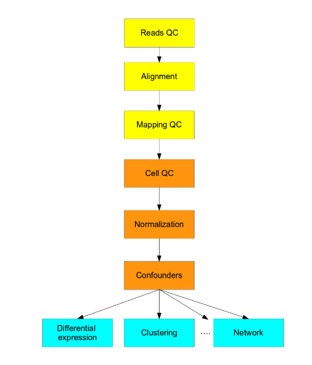
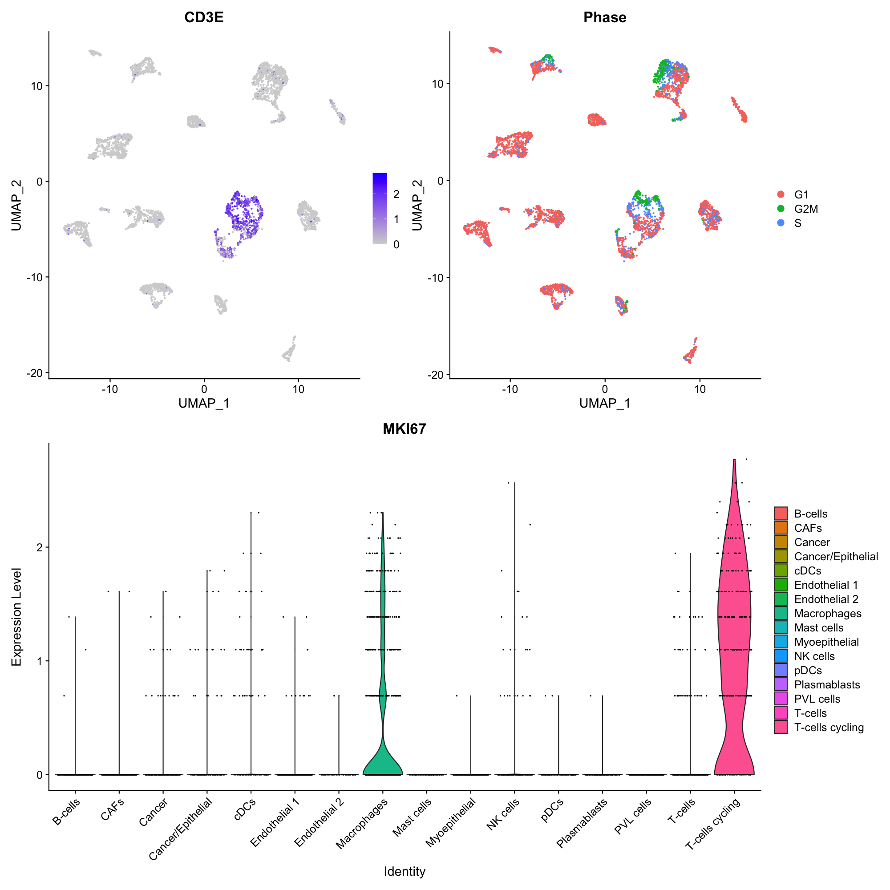

```{r setup, include=FALSE}
knitr::opts_chunk$set(echo = TRUE,
                      eval = TRUE,
                      message = FALSE,
                      warning = FALSE)
```


# Lab3 - Single cell RNA seq (scRNA-seq)

Nowadays there is a plethora of single cell methods available to obtain genomic information at cellular resolution.

The most obvious advantages with single cell technologies is the fact that we're no longer measuring an average across a larger population of cells, and also the massive throughput (i.e. the number of cells that can be analyzed). This opens up for a number of possibilities to study tissues and organs at an unprecedented resolution. Today, researchers can collect millions of cells from a tissue to create whole atlases, a bit like a google earth for cell types.

It is also worth mentioning that historically, many of the computational methods developed for transcriptomic analysis were developed with "bulk" RNA-seq data in mind. Many of the ideas used for things like quality control, normalization, DE analysis etc. can still be applied to single-cell data sets, but some of the underlying assumptions for "bulk" RNA-seq data are no longer applicable. Nowadays, there's an abundance of single-cell specific computational methods available to solve the same tasks more efficiently!


## 1) Introduction

Short primer: what is scRNA-seq?

-   Experimental protocols that measure expression levels for thousands of genes across a population of cells

-   Addresses biological questions in which cell-specific characteristics are important, e.g. cell type specific response to external stimuli, differentiation trajectories and cell-cell communication.

-   Currently, there are several different protocols in use, e.g. SMART-seq2, CELL-seq and Drop-seq.

-   There are also commercial platforms available, including the Fluidigm C1, 10X Genomics Chromium.

-   In most cases, computational analysis requires adaptation of the existing methods for "bulk" RNA-seq analyses or development of new ones.

Below is a general pipeline for an scRNA-seq data processing and analysis workflow. Note that the general workflow is very similar to "bulk" RNA-seq data analysis!



### Data processing

The first three steps (yellow) are data processing steps which will not be part of this lab. These steps relate to processing of the raw data from the sequencing instrument into an expression matrix with a count estimates for each gene and cell.

### Analysis

The next three steps (orange), include filtering and normalization of the data to end up with a representative expression matrix where outlier data points have been removed and technical sources of variability has been reduced (e.g. difference in read depth, and batch effects).

The last part of the workflow (blue), includes all steps related to data analysis: dimensionality reduction, clustering, differential expression and much much more.

## 2) Construct the expression matrix

Here we will work on a scRNA-seq gene expression matrix which has already been processed [Tung et al](https://www.nature.com/articles/srep39921). The Read QC, Alignment and Mapping QC (the boring stuff) have already been done for us.

Let's start by loading our expression matrix.

```{r read_data}
data <- read.table("data/tung.tsv")
```

The object called `data` is an object of class `data.frame`. A `data.frame` object is usually used to store tabular data in R. data.frames are similar to matrices in the sense that all columns have the same number of rows, but each column can hold a different class. You can think of data.frames as spread sheets where you can put any type of data you want in the columns. Our `data.frame` object only contains numeric values, so we could use a `matrix` format instead, but since some of the R packages we will use later require the `data.frame` format as input, we will stick to this format for now.

It's always a good idea to get familiar with the data, so you can for example check the class, dimensions and the content of the `data.frame`. This `data.frame` contains single-cell data where the genes (features) are in the rows and cells are in columns.

```{r check_object}
# Check class
class(data)

# Check dimensions
dim(data)

# Print top left corner (see what the content looks like)
data[1:5, 1:5]

```

### The Seurat R package

We will use the "Seurat" R package, developed by the Satija Lab <https://satijalab.org/> at NYU. Seurat has become one of the most popular tools for single cell analysis in R and is constantly updated with new features. There are many detailed tutorials available on their website to get started with various types of analyses which is also a reason why it has become so popular among researchers.

A core feature of Seurat is the `Seurat` object. Without going into too much detail, this is an object designed to store expression matrices (raw and normalized) as well as meta data and analysis results. The idea with using this type of object is to keep everything organized in one place, make it easier to run code and to minimize the risk of making mistakes.

The `Seurat` object is an S4 class object and has a bunch of *methods* associated with it. The *methods* available from the `Seurat` package are just like functions in R, but have been specifically designed to work on `Seurat` objects (meaning that they will most likely not work on other object types). Many of them are just there for convenience to make it easier to extract and put in data into the `Seurat` object. We will familiarize ourselves with some of these *methods*, but it's always a good idea to explore the package documentation to make life easier.

If you have installed the Seurat package, the only thing you need to get going is an expression matrix with cells in columns and genes in rows. We will need to load a few other packages for this lab as well!

```{r load_seurat}
suppressPackageStartupMessages({
  library(Seurat)
  library(SeuratWrappers)
  library(batchelor)
  library(gprofiler2)
  library(ggplot2)
  library(dplyr)
  library(magrittr)
})
```

Before we create our `Seurat` object, it can be useful to include some meta data as well. Meta data is typically a table with additional information about our cells, e.g. information about experimental batch, individual, gender etc. The meta data `data.frame` needs to have as many rows as there are cells in our count matrix (each cell should have some meta data associated with it), so it's good practice to check that the row names of the meta data matches the column names of the count matrix.

```{r load_metadata}
metadata <- read.table(file = "data/tung_metadata.tsv", stringsAsFactors = FALSE)
head(metadata)

# Check that rownames of meta data matches colnames of gene expression data
check <- all(rownames(metadata) == colnames(data))

sprintf("gene expression colnames matches meta data rownames: %s", check)

```

Now let's create a `Seurat` object with our expression matrix and meta data `data.frame`.

```{r create_seurat}
se <- CreateSeuratObject(counts = data, meta.data = metadata)
```

To access the meta data from your new Seurat object, you can use double brackets `[[]]`.

```{r head_seurat_object}
# Check the meta data
head(se[[]])

```

Notice that you have some additional columns in your meta data which were added automatically when you created your `Seurat` object. For example, `nCount_RNA` represents the number of unique molecules detected per cell and `nFeature_RNA` represents the number of unique genes detected per cell. These are the two most common quality metrics to check when filtering the data from low quality cells.

You can access any meta data column from you Seurat object using the `$` symbol, just like you would with a `data.frame` object. Below is an example of how to extract the "replicate" column and then summarizing how many cells from each replicate that we have using the `table` function.

```{r table_reps}
table(se$replicate)
```

### Q1

> 1.  How many genes do we have?
> 2.  How many cells do we have?

```{r print_stats}
# Write your code / answer here
# Replace NA with the correct values

number.of.genes <- NA
number.of.cells <- NA

cat(sprintf("Number of genes: %s\nNumber of cells: %s", number.of.genes, number.of.cells))
  
```

Single-cell data typically contain a large number of "samples" (cells). Due to the size of the count matrix and the high frequency of 0 values, `Seurat` stores the data in a "sparse matrix" format to save memory.

You can access the raw data using the `GetAssayData` method and specify that you want to collect the raw expression matrix by adding the argument `slot = "counts"`. Note that this matrix is the same as the `data` matrix that we used to create our `Seurat` object, just in a different format. It's important to know how to export data from the Seurat object as well, for example when you need to apply a method that is not available from the `Seurat` R package.

```{r sparse_matrix}
sparse.exprMat <- GetAssayData(se, slot = "counts")
```

Now we have the raw expression matrix in a sparse format saved to a variable called `sparse.exprMat`. Let's check the class of the matrix and have a look at the top left corner (first 5 genes and first 5 cells).

```{r check_class_sparse}
# Check class of object 
class(sparse.exprMat)

# Extract top left corner
sparse.exprMat[1:5, 1:5]
```

The class of the matrix is called "dgCMatrix" which is a type of sparse matrix format. There are a number of different methods available to compress sparse data (you can have a look at the [wiki](https://en.wikipedia.org/wiki/Sparse_matrix) for sparse matrices). The "dgCMatrix" class is a column-oriented format and the standard class for sparse numeric matrices in the `Matrix` R package. This format is only useful when the data contains a lot of 0 values, which is the case for scRNA-seq data. Using this format, the 0 values aren't actually stored in memory which saves a lot of space.

Column names such as "NA19098.r1.A01" or "NA19098.r1.A02" represent unique cell identifiers, whereas the gene names such as "A3GALT2" or "A4GNT" are given here as gene symbols (HGNC nomenclature).

Sometimes, it's easier to work with a "normal" matrix and if you want to you can simply convert the sparse matrix into a normal matrix using the `as.matrix` function. If we check the size of our count matrix using the "normal" matrix format or the "dgCMatrix", you will see that the latter uses up a lot less memory.

```{r check_dims_sparse_vs_normal}
exprMat <- as.matrix(sparse.exprMat)

# Check class of object 
class(exprMat)

# Extract top left corner
exprMat[1:5, 1:5]

# Print object size
sprintf("Size of sparse matrix: %s", utils:::format.object_size(object.size(sparse.exprMat), "auto"))
sprintf("Size of 'normal' matrix: %s", utils:::format.object_size(object.size(exprMat), "auto"))
```

## 3) Quality Control (QC)

Some cells in your expression matrix might be of low quality and should therefore be removed before proceeding. For example, cells with very few detected RNA molecules could actually represent damaged or dying cells which is something we want to exclude from our data set. It's usually a good idea to explore the data visually to make sense of various quality aspects and then filter the data to remove outliers. Below we'll go through a couple of examples where we look at the distribution of unique genes using a histogram.

### Number of unique genes per cell

To visualize the distribution of number of unique genes per cell as a histogram, we can use the function `hist`. The values in the vector `nGenes` below have been randomly generated from a normal distribution, but in reality the distribution of cell counts are typically a bit skewed.

```{r plot_histogram}
# generate random numbers
nGenes <- rnorm(n = 1e4, mean = 4e3, sd = 500)
# Plot histogram
hist(nGenes, breaks = 50)
```

We can add additional things to our histogram, e.g. a vertical line highlighting a cut-off point. Here we'll highlight the `mean` values, and the 1st and 2nd standard deviations (`sd`) from the `mean`.

```{r plot_histogram_sd}
# plot histogram
hist(nGenes, breaks = 50)

# Add vertical lines
# col = "color", lty = "linetype", lwd = "line width"
abline(v = mean(nGenes), col = "black", lty = "longdash", lwd = 2)
# 1st standard deviation
abline(v = mean(nGenes) - sd(nGenes), col = "darkred", lty = "longdash", lwd = 2)
abline(v = mean(nGenes) + sd(nGenes), col = "darkred", lty = "longdash", lwd = 2)
# 2nd standard deviation
abline(v = mean(nGenes) - 2*sd(nGenes), col = "red", lty = "longdash", lwd = 2)
abline(v = mean(nGenes) + 2*sd(nGenes), col = "red", lty = "longdash", lwd = 2)
```

### Q2

> Make a histogram of the total number of unique genes detected per cell (nFeature_RNA) using the `Seurat` object. Then, highlight the 2nd standard deviation from the mean as vertical lines.
>
> *Hint*: you can access meta data using the `$` symbol.

```{r plot_histogram_answer}
# Write your code / answer here
# plot histogram
```

Sometimes it can be useful to set filtering thresholds using statistical measures such as mean +/- standard deviation, but in real data you typically set a threshold based on visual inspection. Histograms are useful, but the `Seurat` package contains other neat methods to plot quality measurements from your data. The `VlnPlot` method makes it easy to explore quality metrics and also makes it very easy to group the data by different columns in your meta data slot.

Each dot in the violin plot represents a cell and the colored shape behind the dots reflects the density distribution (much like a tilted histogram). Here you can for example see that the cells with the lowest number of unique genes are found in replicate 3.

```{r plot_violin}
VlnPlot(se, features = "nFeature_RNA", group.by = "replicate")
```

Based on this plot, we could for example decide to filter out cells with fewer than 5000 unique genes. The `VlnPlot` method uses the `ggplot2` R package to draw the plots, so if we want to add lines we cannot use the `abline` function like we did before. Instead we'll use a function called `geom_hline`.

```{r plot_violin_threshold}
VlnPlot(se, features = "nFeature_RNA", group.by = "replicate") +
  geom_hline(aes(yintercept = 5000, color = "threshold"), linetype = "longdash") +
  labs(color = "") + # Remove title from color legend
  scale_color_manual(values = c("threshold" = "black")) # Change color of line to "black"
```

### Q3

> Create a new violin plot using `VlnPlot`, but this time include two quality features: number of unique genes per cell and number of molecules per cell, then group the plots by replicate
>
> *Hint*: the features argument of `VlnPlot` can take a character vector with more than 1 feature.

```{r plot_violin_2_features, fig.width=10, fig.height=4}
# Write your code / answer here
```

## 4) Filter

Filtering a "Seurat" object from low quality cells can be done by first identifying the cell names that you want to keep and use these names to subset the object.

Let's filter out cells that have less than 1 million unique molecules or less than 7 thousand unique genes. Below are a few lines of code to extract cell names for cells meeting these two criteria and these cell names are stored in the `keep.cells` character vector.

### Q4

> Use the `keep.cells` character vector to subset the "Seurat" object and complete the code chunk below. Save the new "Seurat" object into a variable called `se.subset`.
>
> *Hint*: You can for example use the `subset` function. Type `?subset.Seurat` in the R console to open up a documentation window for the `subset` function.

```{r subset_seurat}

# Select cells (cell ids) with at least 1 million unique molecules
set1 <- se$nCount_RNA >= 1e6
# Select cells (cell ids) with at least 7000 unique genes
set2 <- se$nFeature_RNA >= 7000

# Select cells where both criteria above are met (set1 AND set2 has to be TRUE)
keep.cells <- colnames(se)[set1 & set2]
head(keep.cells)

# Now use these cell names to subset the "Seurat" object
# Write your code / answer here

```

You will often find that some genes are lowly expressed across your data set. It can be a good idea to filter out such genes as these are not always informative. Just like we don't want to keep low quality cells we don't want to keep low quality genes!

We can compute the overall expression per gene by summing up the count for each row:

```{r gene_counts}
# First get the expression matrix
sparse.exprMat <- GetAssayData(se, slot = "counts")

# Calculate row sums
gene.counts <- Matrix::rowSums(sparse.exprMat)

# Check the results 
head(gene.counts)
```

### Q5

> Compute a new vector (call it `keep.genes`) containing the genes with a total expression higher than 500 across the whole data set. The `keep.genes` character vector should consist of genes symbols.
>
> *Hint*: You should use the vector called `gene.counts` to determine what genes to keep. Check the example above where we filtered out cells. To check if the `keep.genes` variable is a character vector you can use `class(keep.genes)`.

```{r keep_genes}
# Write your code / answer here
```

Now that we have this vector we can subset the "Seurat" object that we just created (`se.subset`), but this time we'll apply the filter to the genes instead.

```{r subset_genes}
se.subset <- subset(se.subset, features = keep.genes)
```

Now that we have filtered our object (`se.subset`), we should have fewer cells and fewer genes.

### Q6

> 1.  How many cells do we have after filtering?
> 2.  How many genes do we have after filtering?

```{r print_dims_after_filter}
# Write your code / answer here
# Replace NA with the correct values
nCells <- NA
nGenes <- NA
sprintf("Number of cells after filtering: %s", nCells)
sprintf("Number of genes after filtering: %s", nGenes)
```

## 5) Normalization

There are some specific challenges associated with single cell data. In particular, the data is much sparser compared to "bulk" RNA-seq data. A result, the number of genes detected in a single cell is typically only a fraction of the number of genes expressed across the genome. In other words, a lot of genes have 0 expression in a given cell.

The missing genes are referred to as **gene "dropouts"** and these make it challenging to compare expression levels across cells. Dropouts are less common in "bulk" sequencing data because you pool transcripts from a large number of cells at the same time, thus increasing the chance of measuring any one gene.

The total amount of RNA molecules that are measured in a cell (referred to as "library size") depends on a number of technical and biological features. For example, larger cells typically contain more RNA molecules and cells with lower expressional activity contain less RNA. These are examples of sources of variability which we are not interested in and are commonly referred to as "confounding factors".

To make the expression levels comparable across cells, we can address confounding factors by applying a normalization method. A good normalization strategy can be used to transform a raw expression matrix into a new matrix where expression levels are comparable across cells in a more meaningful way. You can find a number of normalization strategies and more in depth theory [here](https://scrnaseq-course.cog.sanger.ac.uk/website/cleaning-the-expression-matrix.html#normalization-theory).

In this course, we will use a method called variance stabilizing transformation ([VST](https://www.biorxiv.org/content/10.1101/576827v2)), a method which is provided by the `SCTransform` function from the `Seurat` package:

NOTE: Normally you would of course continue to work on the filtered object (`se.subset`), but here we will use the unfiltered object so that you can continue with this lab even if you didn't finish the filtering step yet. If you use the `se.subset`, the remaining steps will look a bit different so please stick to using the unfiltered `se`.

```{r sctransform, eval=FALSE}
# can take up to a few minutes to run
# se <- SCTransform(se, verbose=FALSE)

# To save some time and resources, we have already normalized the data for you
# By running the code below, you will load a pre-processed object
se <- readRDS(file = "data/se")

```

When the normalization is finished, you will have a new "assay" stored in the `Seurat` object called "SCT", which contains the normalized data. This assay will automatically become the "active" assay for subsequent analyses. The "active" assay contains data that will be used as input to any method that you apply to your `Seurat` object which requires an expression matrix as input. In practice, this means that whatever method you apply to your `Seurat` object from now will be applied to the normalized data from now on.

If you type `DefaultAssay(se)`, you should get "SCT".

```{r default_assay}
DefaultAssay(se)
```

If you just paste the object in your console and hit ENTER, you will get some basic information about the data set such as what assays that are present and which one is active. You could have any number of assays available and it's important to know what assay you are working on. Here you can also see that the "active" assay is "SCT" but you also have another assay called "RNA" which contains the raw data. If you want to switch assays you can use the `DefaultAssay <-` method instead, like this:

`DefaultAssay(se) <- "RNA"`

```{r print_seurat}
se
```

## 6) Dimensionality reduction

A single-cell data set is composed of several cell types which are all characterized by the expression of specific sets of genes. If we were to zoom in on a specific cell type, it is reasonable to expect that there exists some set a co-expressed genes which defines this cell type. For example, you might find that a cell type express sets of genes related to neuronal activity, immune response or oxygen transport and based on these genes sets it should be relatively straightforward to figure out what function the cells have or where they originate from.

In reality, a scRNA-seq data set represent many complex interactions between different genes and these interactions can vary across different cell types and cell states. But there are typically some very clear patterns in the data and what we want to do is to make sense of these patterns. One major benefit with scRNA-seq data is that we can fish out different patterns using machine learning methods. Dimensionality reduction methods represent a family of machine learning methods which are particularly suitable for this task.

As the name implies, a dimensionality reduction method can be used to reduce a high dimensional data set into a representation with fewer dimensions. These new dimensions can pick up sources of variability in the data set, such as signalling pathways, immune functions, metabolic activity, apoptotic activity etc.

The most useful patterns are often the ones that represent some biological variability, but you can also find patterns which represent technical variability. An example of technical variability could be if you have doublet cells in your data. We are only interested in analyzing individual cells, but sometimes two or more "connected" cells slip through the experimental procedure because of technical limitations of the protocol. We can address most of the technical variability using normalization and filtering procedures, but you should always keep an eye out for technical confounders!

The interpretation of dimensionality reduction vectors can be confusing, so it can be helpful to simply think of them as patterns representing some biological or technical variability. Also, for scRNA-seq data, dimensionality reduction methods have become crucial to visualize the data which we will see later in this lab!

First, let's have a look at the most widely used dimensionality reduction method called Principal Component Analysis (PCA). This method can be applied to our Seurat object using the `RunPCA` function.

Let's first compute a PCA representation of our data:

```{r PCA}
se <- RunPCA(se, verbose = FALSE)
```

We can then plot the transformed data by using the function `DimPlot()` and specify the reduction that we want to use:

```{r pcaplot1, fig.width=7, fig.height=6}
DimPlot(se, reduction = "pca", dims = c(1, 2))
```

Here we have plotted the first two PCA vectors (1 and 2) by setting `dims = c(1, 2)` and you can only visualize two at the time. PCA vectors are centered at 0 so you will always get both positive and negative values on the axes. You can already see that the cells form two groups in the plot.

We can also color the cells using information from our meta data table. Let's color the cells based on replicate:

```{r pcaplot2, fig.width=7, fig.height=6}
DimPlot(se, reduction = "pca", dims = c(1, 2), group.by = "replicate")
```

Exploring these types of plots can be useful to find out if variablity in your data can somehow be attributed to previous knowledge about your data.

```{r vlnplot_pca, fig.width=9, fig.height=6}
VlnPlot(se, features = paste0("PC_", 1:6), group.by = "replicate")
```

Here you can clearly see that r1 stands out in PC_3. We actually know here that the colors represent technical replicates, meaning that the cells have been sampled from the same populations. So from this we can draw the conclusion that the separation along PC_3 represents a technical effect and should be removed. This type of technical effect found between groups processed independently is commonly referred to as a "batch effect" because the cells have been processed in three different batches. (A batch effect could for example be represented by different sequencing dates, different labs, different experimentalists or even different experimental platforms but should always refer to non-biological factors).

The `SCTransform` normalization method allows us to model and account for minor batch effects by passing variables to "regress out".What we have to do is to specify a batch variable so that the `SCTransform` function knows how the cells are partitioned into different batches. We can do this using the `var.to.regress` argument:

`se <- SCTransform(se, vars.to.regress = "replicate", verbose=FALSE)`

Unfortunately, this approach is often not enough to correct for more severe batch effects. Here we will instead apply a different approach called mnnCorrect ([Hagverdi et al. 2017](https://www.nature.com/articles/nbt.4091))

To run mnnCorrect on our Seurat object we will use the wrapper function `RunFastMNN()`. This function takes a list of `Seurat` objects as input, one for each batch, so the first thing we need to do is to split our `Seurat` object into a list of objects.

```{r sctransform_batch, eval=FALSE}
se.list <- lapply(unique(se$replicate), function(r) {
  subset(se, subset = replicate %in% r)
})
```

Now that we have our list of `Seurat` objects, we can run the batch correction.

NOTE: We have commented out the code to run the actual batch correction in the code chunk below because it takes some time to compute and uses up quite a lot of resources. Instead, we will just load the result from `RunFastMNN`.

```{r mnnCorrect}
# This code is used to run the integration but you do not need to run it here
# se.corrected <- RunFastMNN(object.list = se.list, assay = "SCT", features = 3000, verbose = TRUE, reconstructed.assay = "MNN")

# load the result from RunFastMNN() which have already been computed for you
se.corrected <- se
se.corrected@assays$MNN <- readRDS(file = "data/MNN.assay")
```

Now we will have access to a corrected version of our count matrix that we can use for downstream analysis. To use this new, batch corrected assay, we need to switch our default assay to "MNN". Then we scale the data and rerun the PCA.

```{r scale_and_pca}
DefaultAssay(se.corrected) <- "MNN" # Set default assay to the batch corrected assay
se.corrected <- ScaleData(se.corrected) # Scale data
se.corrected <- RunPCA(se.corrected, verbose = FALSE) # Rerun PCA
```

Now we should see that the separation of replicates along PC_3 is no longer present.

```{r vln_pot_after_batch_corr, fig.width=9, fig.height=6}
VlnPlot(se.corrected, features = paste0("PC_", 1:6), group.by = "replicate")
```

Let's try another dimensionality reduction method called UMAP. This method is commonly used to "embed" the cells into a 2D map that can be very useful for visualization purposes when working with high dimensional data. If you are interested, there are many good resources which explain the UMAP method, for example [here](https://pair-code.github.io/understanding-umap/).

In a UMAP plot, cells with similar gene expression are put close to together in space and the idea is that the 2D structures reflect the size and variability of cell type populations. You shouldn't over analyze these plots, but at least you get a nice 2D map to point at when discussing your results which can be very handy!

Let's see how the cells are organized in UMAP space before and after batch correction:

```{r UMAP2, fig.width=10, fig.height=5}
se <- RunUMAP(se, dims = 1:30, reduction = "pca")
se.corrected <- RunUMAP(se.corrected, dims = 1:30, reduction = "pca")
p1 <- DimPlot(se, reduction = "umap", group.by = "replicate")
p2 <- DimPlot(se.corrected, reduction = "umap", group.by = "replicate")
p1 - p2
```

Now we can see that the data from three replicates are more evenly mixed after correction, suggesting that the batch effect has been successfully removed from our data.

In most larger studies on single-cell data, technical batch effects can be very hard to isolate and account for. But above all, it is crucial to think carefully about the experimental design even before you start processing your cells in the wet lab, so that you can actually isolate batch effects at all.

Take the Tung data set that we just used for example. If the individuals were processed each in a separate batch, it would very difficult to distinguish technical variability across batches from biological variability across individuals!

## 7) Breast cancer scRNA-seq data

For the rest of this lab, we'll use a different data set with single-cell RNA-seq data obtained from breast cancer tissue. You can find the article [here](https://genomemedicine.biomedcentral.com/articles/10.1186/s13073-021-00885-z). The total data set consists of approximately 120k cells but here we have down sampled this to about 4% to speed up computations. We should also mention that the data set have been modified to simplify the analysis workflow and you will therefore find that some cell types are missing compared to the results presented in the article.

When you run `bc <- readRDS("data/bc")` you will get a `Seurat` object with some additional meta data included. The object has already been subjected to normalization with `SCTransform()` and dimensionality reduction by PCA.

```{r clean, message=FALSE, warning=FALSE}
# Before we proceed with the second part of this lab, let's clean up our environment
rm(list = ls())
gc()
```

```{r bc, warning=FALSE, message=FALSE}
# Load the breast cancer scRNA-seq data set
bc <- readRDS("data/bc")
```

Let's embed our cells in a 2D map using the UMAP method as before.

```{r UMAP1, fig.width=7, fig.height=6}
bc <- RunUMAP(bc, dims = 1:30)
DimPlot(bc, reduction = "umap")
```

Here you can already see some potentially interesting patterns in the data; some bigger blobs, some smaller blobs, some are isolated and some are connected. Again, we shouldn't over interpret these plots, but at least now we have some abstract view of how many distinct cell communities there are and how many cells belong to each community.

We know that the cancer microenvironment contain a diverse set of cell types so now the next question is, where do we draw the lines to separate the blobs into cell type populations?

## 8) Clustering

Clustering of scRNA-seq data refers to methods used to group samples (cells) based on gene expression similarity (<https://www.nature.com/articles/nmeth.4299>). The methods are typically unsupervised or semi-supervised, meaning that we can define group structures in the data with little or no prior knowledge about the data beforehand. It's important to understand that clustering methods will almost always be able to find structures in your data, but they don't tell you if the structures are truly representative of cell types or not. Cells can for example be differentiating, proliferating or adapting to their surroundings (microenvironment), therefore producing a spectrum of cell states without clear cut border. We often have to compromise and settle for a level of detail which is suitable for the biological questions of interest. Sometimes we might even wan to present groups of cells at several levels of detail.

For example, consider a scRNA-seq dataset with tens of thousands of cells collected from a tissue with an ongoing inflammation, meaning a high infiltration of lymphocytes. In this data set, you have identified a group of cell with memory B-cell gene signature. In a broader context when looking at whole tissue sample, the memory B-cell would belong to the super group of immune cells (together with T-cells, macrophages, dendritic cells, granulocytes etc.). If you zoom in on the immune cells you can further subdivide them into lymphocytes and myeloids. Add another level of detail and you can divide the lymphocytes into B-cells, T-cells, ILCs and NK cells. Aaaaaand finally you might end up splitting the B-cells into naive B-cells, memory B-cells and plasma cells. But it doesn't even have to stop here! These memory B-cells might exist in different sub types or states depending on where they areand how they developed. This may seem a bit messy, but the fact that you can explore whole lineages of cell types is to a large extent what makes scRNA-seq methods so useful!!!

Anyways, in standard scRNA-seq analysis workflow you have to start somewhere, and running a clustering algorithm with default settings is often a good place to start. What people usually do is to cluster the cells and then define (annotate) the clusters as different cell types based on their specific expression of "marker genes". Here, marker genes can be thought of as genes known to be highly expressed by a specific cell type compared to all other cell types. For example, CD19 is known to be expressed only by B-cells. Exploring marker genes in your data set can also be a useful sanity check to see if your clusters make sense.

Let's try clustering our data using the default method provided by Seurat's `FindNeighbors()` and `FindClusters()` functions. The parameter called `resolution` can be tweaked to obtain a different number of clusters. Lowering this value will result in fewer clusters and increasing this value will result in more clusters. Here we will use a resolution of 0.6.

### Q7

> Use `DimPlot` to color the cells by cluster on the "umap" graph. Write down how many clusters do you get using a resolution of 0.6?
>
> *Hint*: note that the first cluster is always called "0", not "1"

```{r clustering, fig.width=7, fig.height=6}

bc <- FindNeighbors(bc, dims = 1:30, reduction = "pca")
bc <- FindClusters(bc, resolution = 0.6)

# Write code for DimPlot here

# Replace NA with the correct number of clusters 
nClusters <- NA
sprintf("Number of clusters detected at a resolution of 0.6: %s", nClusters)

```

### Q8

> Re-run the `FindClusters()` function using a resolution of 0.3 and 1.2. Use `DimPlot` to visualize these clusters on the "umap" graph and write down how many clusters you get.

```{r clusters_q, fig.width=12, fig.height=5}

# Write your code / answer here

# Replace NA with the correct values
nClusters.0.3 <- NA
nClusters.1.2 <- NA
sprintf("Number of clusters detected at a resolution of 0.3: %s", nClusters.0.3)
sprintf("Number of clusters detected at a resolution of 1.2: %s", nClusters.1.2)

```

We have already provided a column in the meta data slot with cell type labels so you do not need to do the dirty work of defining clusters, identifying markers and annotating the clusters.

```{r dimplot_celltypes, fig.width=8, fig.height=6}
DimPlot(bc, group.by = "CellType", label = T)
```

These cluster annotations have been determined based on marker genes found in the literature. For example, MS4A1 is expressed specifically by B-cells, KIT by mast cells and CD14 by Monocytes/Macrophages.

### Q9

> Draw a new plot showing the expression of these three markers c("MS4A1", "KIT", "CD14") in the UMAP embedding.
>
> *Hint*: You can use the function `FeaturePlot()` (type `?FeaturePlot` in the R console for details) which is very similar to the function `DimPlot()`. Alternatively you can visualize the marker expression using another function called `VlnPlot()` (type `?VlnPlot` in the R console for details).

```{r featureplot_markers, fig.width=10, fig.height=8}

# Write your answer here
```

## 8) Marker detection

In the clustering section above you got a Seurat object where the cells had already been assigned a cell type label. But how would you go about if you needed to do this yourself?

What you typically want to know is what genes are specifically expressed in each cluster? `Seurat` offers a couple of functions to explore this, but the most common approach is to run a differential expression (DE) test pairwise for each cluster against the background (all other cells).

`FindMarkers()` allows you to test for differential expression between two groups of cells whereas `FindAllMarkers()` does a pairwise test between each group and its background and returns differentially expressed genes for all groups.

Let's run `FindAllMarkers()` to get a table of differentially expressed genes per cluster:

```{r findallmarkers}
bc <- SetIdent(bc, value = "SCT_snn_res.0.6")
bc.markers <- FindAllMarkers(bc, logfc.threshold = 0.5, only.pos = TRUE, max.cells.per.ident = 50)

# Here we will filter the data to keep only the top 2 genes based on avg_log2FC
top2.markers <- bc.markers %>% 
  group_by(cluster) %>% # This will group the results of bc.markers by cluster
  top_n(n = 2, wt = avg_log2FC) # This will select the top 2 genes with respect to highest avg_log2FC
top2.markers
```

In the `top2.markers` table you can find the top 2 most distinct marker genes per cell type based on adjusted p-value. In this table you can find some other metrics as well, e.g. avg_log2FC (short for average log-fold change) that measures the expression in a cell type relative to its background or p_val_adj (short for adjusted p-value) which gives you a MH-corrected p-value for each gene.

### Q10

> Draw a new plot showing the expression of 1 marker (not 2!) per cell type on the UMAP embedding.
>
> *Hint*: Use the function `FeaturePlot()` (type `?FeaturePlot` in the R console for details). You can adjust the size of the plot window by changing the `fig.width` and `fig.height` options below.

```{r marker_per_celltype, fig.width=14, fig.height=15}
# Write your code/answer here
```

One nice way to visualize DEGs is to present the scaled expression of the most significant genes in a heatmap. With this plot you can also appreciate the within and between group variability of the marker genes.

```{r de_heatmap, fig.width=12, fig.height=14}
bc <- SetIdent(bc, value = "SCT_snn_res.0.6")
top6.markers <- bc.markers %>% 
  group_by(cluster) %>% 
  top_n(n = 6, wt = avg_log2FC)
DoHeatmap(bc, features = top6.markers$gene)
```

In some cases you might find that a gene is highly expressed in multiple clusters. This just means that the marker gene that you have chosen is not specific enough to single out that particular cluster. A good example of this are the MHC class II genes HLA-D\* which are expressed by multiple antigen presenting cells including; macrophages, B-cells, pDCs and cDCs. It can be very time consuming to find good marker genes so it's usually a good idea to read up on the literature to see what markers other people have found previously. There is not guarantee that you actually find genes that are specific to your cluster of interest, but using a set of multiple markers might do the trick.

## 9) Functional enrichment analysis (FEA)

Once you have obtained a set of marker genes, it could be useful to perform FEA. We do this by comparing the enrichment of any type of biologically relevant labels (for example GO terms) in our set of marker genes to that in the background.

First of all, we need to define a set of marker genes to use as a query for the FEA. In this example we will be a bit more stringent in the selection of marker genes and select those with an adjusted p-value lower than 0.01 and an average log fold change higher than 1. We will select a set of marker genes for Cancer/Epithelial cells and test against the <GO:biological> processes terms.

```{r fea, eval=FALSE}

# cluster 12 represent Cancer/epithelial cells
cancer_epithelial_markers <- subset(bc.markers, cluster == "12") %>%
  filter(p_val_adj < 0.01, avg_log2FC > 1) %>%
  pull(gene)

# Run FEA
res <- gost(query = cancer_epithelial_markers, 
            organism = "hsapiens", 
            significant = TRUE, 
            sources = "GO:BP")

# Check results
head(res$result, 10)

```

In the result `data.frame` we can find quite a lot of information, but the most important thing to look at are the term names and p-values. We find quite a few significant terms related to epithelial development and cell differentiation which makes somewhat sense since we are looking at epithelial derived cancer cells.

### Q11

> Now run another FEA but this time on T-cell markers and set the `avg_log2FC` to 0.5 when selecting the marker genes. Use the same reference database as before (<GO:BP>). Then report the term name and p-value for the most significant term.
>
> *Hint*: T-cells are the same as cluster 2.

```{r fea_T_cells, eval=FALSE}

t_cell_markers <- subset(bc.markers, cluster == "2") %>%
  filter(p_val_adj < 0.01, avg_log2FC > 0.5) %>%
  pull(gene)

# Run FEA
res <- gost(query = t_cell_markers, 
            organism = "hsapiens", 
            significant = TRUE, 
            sources = "GO:BP")

# Check results
head(res$result, 10)

```

```{r fea_ans1}

# Replace NA with the correct answers
term_name <- NA
p_value <- NA

cat(sprintf("term name: %s\np-value: %s", term_name, p_value))

```

FEA can be useful to assign biological attributes to cells and can be particularly helpful in the process of cell type annotation. If we didn't know what cell types we were looking at in the examples above we could tell from the FEA that cluster 2 most likely is a type of T cell but it less clear from the FEA what cell type cluster 12 is. FEA can be good a complement to other types of analyses but they are not very robust as the results are largely dependent on marker gene selection process.

## 10) Other sources of variability

It is worthwhile mentioning that there can exist other less evident sources of variability in the data. One common technical source of variability is the presence of doublets or multiplets. Depending on the scRNA-seq method used to produce the data, you can expect to find some small percentage of doublets which is essentially two attached cells that have slipped through the size selection process. Doublets result in a mixed gene expression signal and can even produce "artifical" clusters. There are methods to identify and remove doublets from your dataset but we will not go through them here.

Another important source of variability that is actually biological is cell cycle phase. As you all know, dividing cells go through a series of phases including the G1 phase (cell growth), the S phase (synthesis) and G2M (cell growth and mitosis). `Seurat` provides a function to estimate an `S.Score` and `G2M.Score`, using canonical markers which can be used to check if some cells are dividing in your data. Based on the `S.Score` and `G2M.Score`, a label will also be assigned to each cell which is stored as "Phase" in the `Seurat` object.

```{r cellcycle, fig.width=12, fig.height=5}
bc <- CellCycleScoring(bc, s.features = cc.genes.updated.2019$s.genes, g2m.features = cc.genes.updated.2019$g2m.genes, set.ident = TRUE)
VlnPlot(bc, features = c("S.Score", "G2M.Score"), group.by = "CellType")
```

Obviously, the cycling T-cells have high S and G2M phase scores but we can see that some cells in other clusters also appear to be dividing. We can also display this in a `FeaturePlot`:

```{r ftrplot_cellcycle, fig.width=12, fig.height=5}

p1 <- FeaturePlot(bc, features = "S.Score", order = TRUE, cols = rev(RColorBrewer::brewer.pal(n = 11, name = "RdYlBu")))
p2 <- FeaturePlot(bc, features = "G2M.Score", order = TRUE, cols = rev(RColorBrewer::brewer.pal(n = 11, name = "RdYlBu")))

p1 - p2

```

In the UMAP plot you can see that the cell cycle scores actually reflect the organization of cells within some of the clusters. For example, if we look at the macrophage and cDCs populations, we can see a gradient of S phase, G2M phase and fully differentiated cells. The cycling macrophages are still quite similar to differentiated macrophages in their expression profiles and therefore cluster together, but if we were to increase the clustering resolution we might very well be able to distinguish cycling macrophages from differentiated macrophages. The cell cycle phase can sometimes be so determinant of the overall cell state so that cycling cells from different cell types form their own cluster. If the cell cycle state is irrelevant for the biological question of interest, it is common practice either regress out the effects of cell cycle phase in the normalization process or remove cycling cells from the analysis.

### Q12

> 1.  Draw a plot showing the T-cell marker `CD3E` on the UMAP embedding and save it to a variable `p1`.
> 2.  Draw a second plot showing the `Phase` labels in the UMAP embedding and save it to a variable `p2`.
> 3.  Draw a third plot showing the expression of the proliferation marker MKI67 in each CellType (`VlnPlot`) and save it to a variable `p3`
>
> Put `p1` and `p2` side by side in the top row and the `p3` plot in the bottom row.
>
> The plot should look similar to this: 
>
> *Hint1*: You can use the "patchwork" system by simply combining plots with simple symbols such as `+`, `-` or `|` (check documentation `?patchwork` or github page [patchwork](https://github.com/thomasp85/patchwork))
>
> *Hint2*: You can visualize numerical data (e.g. gene expression, number of unique genes per cell, cell cycle scores etc.) on a UMAP using `FeaturePlot`. Categorical data can be visualized on a UMAP using the `DimPlot` function. Note that the group variable is passe using the `group.by=` argument in `DimPlot`.

```{r phase_score, fig.width=10, fig.height=8}
# Write your code/answer here

```

The patchwork plot system in combination with ggplot2 makes it very easy to assemble nice figures for reports and even publications. While this plot in particular is not very meaningful for biological interpretation, it can be extremely useful to learn how this system works!

Now that we have access to information about the cell cycle phase for each cell, it would be interesting to summarize what cell types are proliferating. Below is a bar chart showing the proportion of each cell cycle phase for each cell type.

```{r bar_chart, fig.width=8, fig.height=5}
ggm <- as.data.frame(table(bc@meta.data[, c("Phase", "CellType")]))
ggm <- ggm %>%
  group_by(CellType) %>%
  mutate(proportion = Freq/sum(Freq))
ggplot(ggm, aes(CellType, proportion, fill = Phase)) +
  geom_bar(stat = "identity", position = "dodge", color = "black") +
  scale_y_continuous(labels = scales::percent) +
  theme_minimal() +
  theme(axis.text.x = element_text(angle = 50, hjust = 1), 
        panel.grid = element_line(color = "darkgrey", linetype = "longdash")) +
  scale_fill_brewer(palette = "YlGnBu")
```

Here it becomes quite clear what cell types are proliferating and what cell types are already differentiated.

### Q13

> What are the four cell types with the fewest cycling cells?
>
> *Hint*: The answer should be a character vector with 4 cell type names.

```{r q13}
# Replace NA with the answer
q13.answer <- c(NA, NA, NA, NA)
cat(sprintf("Answer: %s", paste(q13.answer, collapse = ", ")))
```

## Hand In Guidelines

**How**: Complete the code chunks after the questions marked with a ''Q'' in this .Rmd file. There are 13 of those. When you have completed these code chunks, you should knit this report into an html file and submit this in canvas under Computer Lab 3. Do not edit the top part of the code chunks except for adjusting the plot layout using fig.width and fig.height.

**Deadline**: Your report is due 23:59, one week after the schedules lab session; if working in pairs - each of you should hand in (identical) reports where the names of both authors are clearly stated. For further information see the guidelines on the course web-page.
