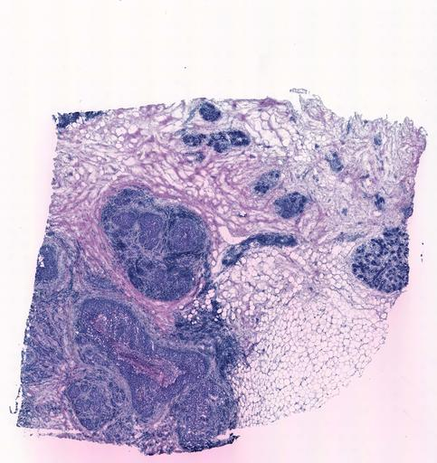

<style>
p.comment {
background-color: #DBDBDB;
padding: 10px;
border: 1px solid black;
margin-left: 25px;
border-radius: 5px;
font-style: italic;
}

</style>


```{r setup, include=FALSE}
knitr::opts_chunk$set(echo = TRUE,
                      eval=FALSE,
                      message = FALSE,
                      warning = FALSE)

```

# Lab3 - Spatial Transcriptomics

## Before you start 

### Data
We have provided you with some nice data for this lab, all of this can be found
in the folder named ''data\_lab3'' which is available on canvas. Make sure to
download this folder and _place_ it in the same directory as this markdown file.

You can run the code below to check that you have the correct files and folders
downloaded/saved to the right location.

```{r, eval=TRUE}
# Run this snippet of code to check whether all files and folder necessary
# to conduct the lab exists. 

cwddirs <- list.dirs(getwd()) 
ismain <- sapply(list.dirs(getwd()),
                 function(x){basename(x) == 'data_lab3'})

if (sum(ismain) > 0 ){
  necfiles <- c("counts.tsv",
                "he_image.jpg")
  if (all(necfiles %in% list.files('data_lab3'))) {
    print("[STATUS] : OK - all files downloaded")
  } else {
    print("[STATUS] : WARNING - some files are missing")
  }
} else {
  print("[STATUS] : WARNING - missing folder data_lab3")
}

```

### Format

For this lab *we want you to knit your Rmd file*, and hand in the resulting
*html* file. Do not create a new separate file for your answers, instead make
edits to _this_ file.

The html file named initial.html contains the knitted
version of this "empty" report, open it in a web browser to get an idea of what
your end-result should look like.

P.S. If you cannot knit your file, that means the code you've entered is wrong,
so it's a good way to check that everything runs smoothly.


## Intro

In this lab we will look at Spatial Transcriptomics (ST) data.

The dataset that we will work with is a real example of a Breast Cancer tissue
biopsy. By studying the histology image together with the RNA-seq data, we will
be able to characterize the transcriptome of distinct regions.
This is the tissue section that we will work with:



Unless you're a pathologist, a histology image by itself might not tell you very
much. Nevertheless, in this particular case, it's fairly easy to see where the
tumor areas are. Traditionally, if one was to use "bulk" RNA-seq, there would be
no distinction of different tumor areas, as they would all be mixed together. The
expression profile that you end up with would be nothing more than an
_average_ of both ''tumor'' and ''healthy'' regions, which would be hard to draw
any insightful conclusions from.

## Load the data

As in lab 2, we will use the Seurat package when working with our data, despite
Seurat mainly being designed for single cell data - a lot of the analyses and
features it offers are applicable to ST data as well. 

_Note_ : as of 09/12/2019 Seurat have a module for analysis of spatial data (Visium),
however this lab will focus on the more basic functions of  Seurat. If you are intereseted
you can check out [Seurat's Spatial Module](https://satijalab.org/seurat/v3.1/spatial_vignette.html).

<p class ="comment">
*Q1:* Start by downloading the
Load the count data into R
using `read.table`. The file we want you to use is : `data_lab3/counts.tsv`:
</p>

```{r, eval=TRUE}
# Write your code that loads the count file here

```

If you inspect the column-names, you may notice that rather than identifiers for
''samples'' or ''cells'', these represent ''spot'' ids. The structure of the
names is [x-coordinate]x[y-coordinate], meaning that it's easy to extract the
coordinate for each spot from these names.

## Filter out low abundance genes.

There are quite a lot of genes here with very low count values across the
tissue. For these lowly expressed genes our sample can likely not be considered
representative of the actual expression landscape.

In short, these lowly expressed genes are uninformative and introduces noise
into our analysis, thus we fill filter the data in order to remove them. Note
how we are doing this _prior_ to analyzing the data, hence it's not equivalent
to the somewhat dubious act of "outlier removal".

<p class="comment">
*Q2:* Set a threshold so that the **remaining**
genes have a **total sum of at least 10 reads across all spots**.
</p>

```{r, eval = TRUE}
# Write your code that filters your genes here 

```

## Create the Seurat object

<p class="comment">
*Q3:* Create a Seurat object for our data, name it `se`.
</p>

```{r, eval = TRUE}
# Write your code that generates a seurat object here 

```

_Note_ : When filtering or modifying the seurat *do not* create multiple new
objects, overwrite the old one. Meaning that througout this lab, you should only
have one seurat object named ''se''. Creating multiple new objects is heavy on
the memory, and also gets messy very quickly.

### Spot filtering

We also want to remove spots with few observed transcripts.

<p class="comment">
*Q4:* Filter out all spots with **less
than 500 reads across all genes** (using for example, but not necessarily, the `subset` function).
</p>

```{r,eval = TRUE}
# Write your code here

```

Run the code below to check that the preceding steps were correctly executed.

```{r,eval = TRUE}
# Code to check that that the preceding steps were
# executed correctly

if (exists("se")) {
  nG <- dim(se)[1]
  nS <- dim(se)[2]

  if ((nG == 9898) & (nS == 606)) {
    print("Correct number of genes and spots.")
  } else {
    print("Incorrect number of genes or spots.")
  }
} else {
  print("No se-object created yet")
}
```

## Normalize the data

<p class="comment">
*Q5:* Just as we did in lab 2, normalize the data using `SCTransform`:
</p>

```{r}
# Write your code to transform the data here.
```

## Plot the data

As we discussed earlier, the spatial coordinates are saved as column names in the count
file. 

Below you will find a function that extracts the coordinates from the spotnames
and returns a data frame with two columns named 'x' and 'y', these columns
contain the x respectively y-coordinates for the tissue. You are welcome to use
this function, but may also write your own - as a nice exercise in R.

```{r, eval=TRUE}
# Example code for extracting coordinates

extractCoordinates <- function(seObj) {
  # Function that extracts 
  # coordinates from a Seurat object

  crd <- t(sapply(gsub('X','',colnames(seObj)),
                  function(x) {strsplit(x,'x')[[1]]}))

  outdf <- data.frame(x=as.numeric(crd[,1]),
                      y=as.numeric(crd[,2]))
  return(outdf)

}

```

_NOTE_ : To load a function in R, simply run the code (either copy/paste it to
the terminal, or run the code chunk)

Below is an example of how you can plot the returned data frame from the `extractCoordinates` function.

```{r, eval=FALSE}
# Example code for how to plot the coordinate data frame
# obtained when extracting coordinates from a seurat object 'se'
# using the function 'extractCoordinates'.

coordinate_data <- extractCoordinates(se)

plot(x=coordinate_data$x,
     y=-coordinate_data$y,
     col="black",
     lwd=2,
     asp=1,
     ylab="",
     xlab="",
     main=paste("Tissue plot"),
     pch=21,
     cex.main=3,
     xaxt="n",
     yaxt="n",
     bty="n",
     col.main = "black",
     bg = "purple")

```

<p class="comment">
*Q6:* Use the function `extractCoordinates` to generate a data frame named
`coord_df`. Plot the extracted coordinates and answer the two questions below,
the answers should be given as comments.
</p>

```{r, eval = TRUE}

# Write code to extract coordinates and plot them here

# Answer the following questions here :
# Q6.1 : What are we looking at?
# Answer 6.1 : 
# Q6.2 : Why are there holes in the plot?
# Answer 6.2 :

```

### Spatially variable genes

We will now explore what we can do with the fact that we also have spatial
information for our gene expression data.

R has a convenient function named `apply` which allows you to apply a function
along a specified dimension (rows or columns), for example; if we wanted to know
the standard deviation of observed transcripts for each spot across all genes we would do:

```{r,eval = FALSE}
# Example of how to use the apply function
# to obtain the standard deviation across all rows 
# i.e. for each within each column

geneSD <- apply(as.matrix(se@assays$SCT[,]),2,sd)

```

To find out more about the `apply` function, do `?apply`, in the command window.

<p class="comment">
*Q7:* List the genes with highest variance in your data (HINT:
use `var()` and apply it to all rows).
</p>

_Note_: Make sure that you are using the
normalized/transformed data and not the raw counts!

```{r, echo = TRUE, eval = TRUE}

# Write code below that : 
# 1. Creates a vector of gene names sorted by their VARIANCE in the dataset
# 2. PRINTS a table with the TOP FIVE most variable genes

```

### Spatial gene plots

In order to make a color gradient, we can use the function `colorRampPalette`
and set the color range between two colors (low and high).

<p class="comment">
*Q8:* First, extract the
normalized counts of your _4th most variable gene_ and store them as a vector.
</p>

```{r, eval=TRUE}
# Extract the normalized counts of your 4th most variable gene.
# Assign these values to to a variable named "col"
# Write the code here 

```

We will use this vector (col) to create our color gradient (example code is given
below):

```{r,eval = FALSE}

# Example code that creates a color gradient from white to blue
# and assigns a color to each value in the vector named 'vec'

rbPal <- colorRampPalette(c('white','blue'))
color_vector <- rbPal(10)[as.numeric(cut(vec, breaks = 10))]

```
<p class="comment">
*Q9:* Generate a similar plot to the one before, but color the spots based
on gene expression. Also, put the name of the gene as the main title of the
plot.
</p>


```{r,eval = TRUE}

# Write code that generates :
# 1. A color gradient based on the 'col' vector
# 2. The plot described above, using the gradient generated in (1)

```

### Plot the data with the tissue image

One of the main advantages of ST data is that you can overlay the expression
data on the tissue image. Below you will find code to produce such a plot.

_NOTE: you might need to install the `ggplot2` library first
(and load it)_

```{r,eval = TRUE}
# This is the code to load the image.
# You need the "jpeg" package, if not already installed

library(jpeg)
library(ggplot2)

tissue <- jpeg::readJPEG("data_lab3/he_image.jpg")
tissue_grob <- grid::rasterGrob(tissue,
                                width = unit(1, "npc"),
                                height = unit(1, "npc"),
                                interpolate = TRUE)

```

Below we will define the plotting function:

```{r,eval = TRUE}

arrayPlot <- function(coordinates,
                      image) {
    # Set range of axes 
    xmin=1
    xmax=33
    ymin=1
    ymax=35

    # fill grob object with image
    he_image <- ggplot2::annotation_custom(image,
                                           -Inf,
                                           Inf,
                                           -Inf,
                                           Inf)

    xcrd <- as.numeric(coordinates$x)
    ycrd <- as.numeric(coordinates$y)
    # modify coordinates for correct orientation
    ycrd <- ymax - ycrd + ymin
    # create new data frame to not modify passed object
    ncrd <- data.frame(x = xcrd,
                       y = ycrd)

    # create plot object
    ggplot(data=ncrd,
           aes(x=x, y=y)) +
           he_image +
           geom_point(col="green",
                      alpha = 0.5,
                      size=5) +

           coord_fixed() +

           scale_x_continuous(expand = c(0, 0),
                              limits = c(xmin, xmax)) +
           scale_y_continuous(expand = c(0, 0),
                              limits = c(ymin, ymax)) +
           theme_bw() +

           theme(axis.text = element_blank(),
                 axis.title = element_blank(),
                 axis.ticks = element_blank())
}

```

To plot the data, call the `arrayPlot` function like this:

```{r, eval = FALSE, fig.height=12, fig.width=12}

arrayPlot(coord_df, image=tissue_grob)

```
<p class="comment">
*Q10:* Copy and modify `arrayPlot` to color the spots based on the `color_vector` that
you created before and plot the results. Name this new function `coloredArrayPlot`.
Write the code for this new function and answer the questions in the code chunk below.
</p>

```{r, eval = TRUE, fig.height=12, fig.width=12}
# Write your code and answers here

# Q10.1 : Explain what information this image provide you with.
# Answer 10.1 : 
# Q10.2 : Where in the tissue does the gene appear to be expressed the most?``
# Answer 10.2 : 

``` 

## Cluster the data

You will now cluster the spots with k-means and visualize these on the tissue/array.

<p class="comment">
*Q11:* First cluster the spots into 5 clusters.
</p>

```{r,eval = TRUE}
# Write some code that performs k-means on the normalized count values here

```
Remember that cluster labels are stored as an element in the output object
(e.g. if you type `km <- kmeans(...)`, they are found in km$cluster).

In order to create a color palette for the cluster labels, we will use the
command `palette()[km$cluster]`. 

After running this, save the color information as an element in the seurat object's meta data
named ''clusterColor''. Just like we did with ''individual'' and ''replicate'' in Lab2.

```{r,eval = TRUE}
# Write code that stores the cluster color information
# as an element in the seurat object's meta data.
# The element should be named clusterColor.

```

_Note : If you are confused by the ''@'' sign (the symbol used to access assays
and meta data), this is the way to access what is known as ''slots'' in R.
Slots are ''characteristics'' of a class (here the seurat class), and you access
these slots by using ''@'' similar to how you access elements of an object with
''$''. If you've worked with OOP before, this equivalent in many languages tends
to be called an attribute._

<p class="comment">
*Q12:* Make an array plot and color the spots by their cluster labels, using the stored
meta data.
<p>

```{r,eval = TRUE}

# Write your code that generates the plot here

```

## Expression differences between regions

Let's conduct a _differential gene expression analysis_ between two areas. We
can do this in Seurat with the `FindMarkers` function. 

In order for this function to know what to contrast, we first need to set the
cluster assignments as "Idents" (identifiers) in the Seurat object. Do this by :

 * Assigning the clusterColor meta data as the value of :  `Idents(object=se)`

```{r, eval = TRUE}
# Write code that assigns the clusterColor meta data to the Idents object here

```

The function can then be used like in this _example_:

`FindMarkers(se,ident.1 = "green", ident.2 = "black")`

<p class="comment">
*Q13:* Run a differential expression analysis between the tumor area (hint: one of
several tumor areas are in the middle of the tissue) and the non-tumor area
located at the far right of the tissue (which is cell dense) with the
FindMarkers function.
</p>

```{r, eval=TRUE}
# Run a DEA between the tumor area and the cell dense,
# non-tumor area located at the far right of the tissue
# Write the code for this here

```
You will get a table with p-values (adjusted for MHT) and average log-fold changes.

### Inspect DEA results
<p class="comment">
*Q14:* Sort the table from the previous question by the adjusted p-values and print the
top 5 most significantly differentially expressed genes. Remember the definition of p-values.
</p>

```{r,eval = TRUE}
# Write code that prints the 5 most
# significant differentially expressed genes as a table here

```

_HINT : to print a table apply the function `as.data.frame`  to a vector containing the gene names and print this._

<p class="comment">
*Q15:* Now for some more targetes analysis - Choose a gene that you think is
"cancer-associated" and make an array plot showing the expression of that gene.
</p>

```{r,eval = TRUE}
# Write code to genereate the plot described above here 

```
# Hand In Guidelines

**How :** Hand in the knitted html version of this Rmd file, i.e. your hand in
should be in .html format.

**Deadline**: Your report is due 23:59 December 19th 2019; if working in pairs -
each of you should hand in (identical) reports where the names of both authors
are clearly stated. For further information see the guidelines on the course
web-page.

