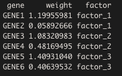

# Lab4 - Spatial Transcriptomics


## Introduction

Welcome to Lab 4, where we will explore spatial transcriptomics data. While it
is a different type of data from what we've worked with before, many of the
ideas and concepts presented in our analysis of single cell RNA-seq data will be
revisited in this lab.

The field of spatial transcriptomics, sometimes also called spatially resolved 
transcriptomics, has grown rapidly in the last decade, and multiple techniques
to obtain information of spatial gene expression exists. Some examples are:
MERFISH, ISS, seqFISH, HDST, Stereo-seq, Seq-Scope, Slide-seq and GeoMx. We will
however be focusing on spatial data generated from the _Visium_ platform (provided
by 10x Genomics). Visium is the successor to the technique - somewhat
confusingly - named Spatial Transcriptomics (commonly referred to as ST). 

ST was developed at SciLifeLab and presented to the world in 2016 when the
publication _Visualization and analysis of gene expression in tissue sections by
spatial transcriptomics_  was published in the journal Science. In December
2018, 10x Genomics aquired the IP rights to the ST-technique, they then launched
the Visium platform in late 2019. In 2020, spatially resolved transcriptomics was 
awarded with "method of the year" in the journal Nature Methods.

Links for more information: 

* [2016 Spatial Transcriptomics method developed at SciLifeLab](https://science.sciencemag.org/content/353/6294/78)
* [Spatially Resolved Trabscriptomics](https://www.nature.com/articles/s41592-020-01042-x)
* [Visium](https://www.10xgenomics.com/products/spatial-gene-expression): 

In this lab, we will explore a dataset generated with the 10x Genomics Visium technology. 
Visium utilize a solid array onto which oligonucleotide with spatial barcodes have been 
printed at locations (spots) arranged in a hexagonal grid. These oligonucleotide all have 
a poly-T sequence, allowing them to capture mRNA's by their poly-A tails. 
A thin tissue slice, collected either from a fresh frozen of FFPE tissue block, is placed 
on top of this array followed by enzymatic permeabilization to open up the cells in the tissue.
mRNA moleculas can diffuse freely from the cells and a large fraction of these molecules 
reach the barcoded surface where they can hybridize to the poly-T sequences.
By reverse transcription, the barcodes of the oligonucleotides will be embedded in a cDNA 
(complementary DNA) molecule synthesized from the captured mRNAs; hence, we know at which 
spatial location (spot) that each transcript was captured. Once the cDNA molecules are sequenced, 
we can map them back to their spatial position - using the spatial barcodes - and by doing so obtain
spatial gene expression information. The Visium slide arrays have 5000 printed spots, but the 
tissue section usually cover only a few thousand of these.

One *key* fact that should be emphasized is that Visium does not operate on a single cell level yet. 
The gene expression data associated with each spot is really *a mixture of contributions from multiple cells*, 
not all necessarliy of the same cell type.


## Configure Rmarkdown and load packages

We begin by configuring our `knitr` settings; in short, we set the default
values for our code chunks - which will affect the behavior and appearance of
the knitted file. Do not change this code chunk.

```{r setup, include=FALSE}
knitr::opts_chunk$set(echo = TRUE,
                      eval = TRUE,
                      message = FALSE,
                      warning = FALSE)

```

Next, let us load some the libraries that we will use in this lab. 

```{r, echo = FALSE, eval = TRUE}

library(STutility)
library(ggplot2)
library(dplyr)
library(rjson)
library(RColorBrewer)
library(magrittr)
library(pheatmap)

```

## Loading Data

In this lab, we will be examining  _one_ tissue section of human HER2-positive
breast cancer, a disease claiming several thousand lives every year. 10x - the
company behind Visium - kindly provide some "example" datasets on their
webpage, which is where this sample is taken from.

Rather than storing the data in the GitHub repository, we'll download it on the
fly. The `bash` code below takes care of this, all you need to do is to execute
it. 

```{r, echo=FALSE, eval=FALSE}

download.file("https://cf.10xgenomics.com/samples/spatial-exp/1.1.0/V1_Breast_Cancer_Block_A_Section_1/V1_Breast_Cancer_Block_A_Section_1_filtered_feature_bc_matrix.h5", "./data/filtered_feature_bc_matrix.h5")
download.file("https://cf.10xgenomics.com/samples/spatial-exp/1.1.0/V1_Breast_Cancer_Block_A_Section_1/V1_Breast_Cancer_Block_A_Section_1_spatial.tar.gz", "./data/spatial.tar.gz")
untar(tarfile = "./data/spatial.tar.gz", exdir = "./data")
file.remove("./data/spatial.tar.gz")

```

As a sanity check, you can run the code chunk below to see if you have the files available.
If not, either something went wrong or you need to rerun the previous code chunk.

```{r}

sprintf("Expression matrix available: %s", file.exists("./data/filtered_feature_bc_matrix.h5"))
sprintf("Spatial data available: %s", dir.exists("./data/spatial"))

```


As you might remember, the expression data is only *one component* of the ST and
Visium assays, we also have an *image* of the very same (stained with
Hematoxylin and Eosin) tissue section to use as a reference and aid in our
analysis. You can visualize the HE-image by running the code chunk below.

```{r fig.width=8, fig.height=8}

im <- png::readPNG("data/spatial/tissue_hires_image.png") %>% as.raster()
par(mar = c(0,0,0,0))
plot(im)

```


Now when we know what our tissue looks like, let us continue with the expression
data. Just as for most data generated from sequencing experiments, the raw data
is stored as `FASTQ` files. However, the `FASTQ` files are about as useful to us
as a concrete parachute would be to a skydiver. Just as for the single cell
data, a bioinformatics pipeline is applied to the `FASTQ` files generated from a
Visium experiment, this time called `spaceranger`. The `spaceranger` pipeline
will output an expression matrix and meta-data with information regarding how
the spot coordinates relate to the pixel coordinates in the HE-image (i.e.,
pairing expression data and image data).

Below we will use the `STUtility` R package to load all the data we need for the lab. 
The data will be stored in a `Seurat` object, just like the ones we used in lab 3,
just slightly modified by `STUtility` to hold the additional spatial information.
With `STUtility`, we will also have access to a bunch of useful functions designed 
to work with spatial data. 

```{r}

# Here we create a data.frame pointing to various files that will be used
# by STUtility to create our Seurat object
infoTable <- data.frame(samples = "./data/filtered_feature_bc_matrix.h5",
                        imgs = "./data/spatial/tissue_hires_image.png",
                        spotfiles = "./data/spatial/tissue_positions_list.csv",
                        json = "./data/spatial/scalefactors_json.json")

# Here we create a Seurat object from our newly created infoTable data.frame
se.HER2 <- InputFromTable(infoTable)

```

If we execute the code chunk below we will get some basic information about 
our Seurat object, i.e. we have 24923 genes (features) and 3798 spots (samples)

```{r}

se.HER2

```

We can also easily extract meta data from our Seurat object by running 
`se.HER2[[]]`. So far, we have five columns named "orig.ident", "nCount_RNA", 
"nFeature_RNA", "id" and "labels".

```{r}

head(se.HER2[[]])

```

*Q1*: Now when the Seurat object is formed, please answer the questions below:

1. How many spots do we have?
2. How many genes do we have?
3. How many UMI's in total do we have, i.e., total amount of observed transcripts?
4. What is the name of the 1306th gene?

_hint_ : You can use the function `GetAssayData()` to retrieve to expression 
matrix (i.e. UMI counts).

Give your answers below

```{r}

# Give the answers to the questions above
# by assigning the values (answers) to
# the variables ans1,ans2 and ans3

ans1 <- NA
ans2 <- NA
ans3 <- NA
ans4 <- NA

cat(sprintf("No. Spots : %d \nNo genes: %d\n1306th gene : %s", ans1, ans2, ans3))

```

You can now check the answers by running the code chunk below!

```{r}

source("checks.R")
q1_check(ans = list(ans1, ans2, ans3, ans4))

```

Let us now make some use of this data that we worked so hard for to obtain! A
good first task, and also a sanity check to make sure that everything went as
expected, is to plot the spots according to their spatial coordinates, which you 
can do with the `ST.FeaturePlot()` function. 

Note that requires a `feature` value to draw on the plot. Here we use "orig.ident" 
which is automatically added to your Seurat object when it is created.

```{r fig.width=6, fig.height=5}

# You can adjust the point size by changing the value for pt.size
ST.FeaturePlot(se.HER2, features = "orig.ident", pt.size = 2)

```

In the top left corner we can see the name of the feature that we selected ("orig.ident"),
above the image we see a number that tells us what section we're looking at (here we only have 1),
and on the right hand side you can see the content of our selected feature which the spots are 
colored by (here we only have 1 category, so we get one color).

If you scroll back to the HE-image above, you can clearly see how the spots
resemble the tissue outlines. This is positive, at least we now know that our
data isn't a complete mess, i.e., so far so good. With these affirmations, we
may proceed to prepare the data (and ourselves) for some fun analysis. 

*Q2*: Use `ST.FeaturePlot()` to visualize the number of unique genes ("nFeature_RNA") per spot. Add 
an argument palette = "Spectral" to get a more fancy color scale.


```{r, fig.width=6, fig.height=5}

# Write the code below

```

How neat is that! Now we can see exactly where in the tissue we obtain higher numbers
of unique genes. You have already seen the H%E image for the tissue section, so by 
now you might have a clue about why some regions have higher numbers of genes than others.
As so often in science, the answer is that it depends. For example, certain parts of the 
tissue might be harder to permeabilize than others, which would result in lower mRNA capture.
However, as a rule of thumb we expect to see higher numbers in more _cell dense_ regions.
Information about cell density is easy to get from the H&E image where cell dens regions are
tightly packed with dark blue nuclei (stained by the hematoxylin).

So far we plotted the spots and then compared them to the tissue image, but
scrolling back and forth is tedious and cumbersome, we can do better than that!
Thanks to the setup of the Visium platform, the spots can (seamlessly) be
overlaid on the tissue.

First, we need to load the H%E image(s) into the Seurat object using the `LoadImages()` 
function. We can then plot our H&E image(s) with the `ImagePlot()` function. It's way 
easier and faster to work with small images, so we will downscale the image to have a 
width of 600 pixels by setting `xdim = 600`.

```{r, fig.width= 7, fig.height= 7}

se.HER2 <- LoadImages(se.HER2, time.resolve = FALSE, xdim = 600)
ImagePlot(se.HER2, method = "raster")

```

Then, if we want to plot features on top of our H%E image(s), we use the
`FeatureOverlay()` function instead of `ST.FeaturePlot()`.

```{r fig.width=6, fig.height=5}

FeatureOverlay(se.HER2, features = "nFeature_RNA", palette = "heat")

```

Now look at that, what a beauty! The spots and tissue overlap perfectly. Now
when we know how to overlay or spots on our image, we can start to play around
a bit more with our data.

The whole **purpose** of using Visium is to associate gene expression to spatial
locations, i.e., each spot has an associated expression value for every gene. To
see this property in action, we will visualize the expression of a gene called
_ERBB2_  (a marker gene for HER2-positive breast cancer). 


```{r fig.width=7, fig.height=6}

# You can play around with the pt.size and pt.alpha (opacity) to make the background more 
# visible
FeatureOverlay(se.HER2, features = "ERBB2", pt.size = 1.5, pt.alpha = 0.5)

```

Interesting indeed! What we see here is how the gene expression of _ERBB2_ is
elevated in the darker regions (=more cells --> more likely to be a cancerous
region). This result is in concordance what we expect, hence we can conclude that 
the data we have collected seems to be of descent quality, nothing weird 
(like mixing up the spatial barcodes) has happened to it.

What's really cool with having an H&E image associated with the expression data,
is that pathologists can annotate regions of interest with labels such as
"cancer" or "benign". These annotations can then be used in our analysis, for
example we can inspect which genes that are up-regulated in these regions. Below
you have such annotations (rough, but still decent) of the same tissue as we are
working with.

Run the code chunk below to see the annotations:

```{r fig.width=8, fig.height=8}

im_ann <- png::readPNG("img/annot.png") %>% as.raster()
par(mar = c(0,0,0,0))
plot(im_ann)

```

* Blue - Fibrous Tissue
* Pink - Invasive Carcinoma
* Green - Ductal Cancer _in situ_ (DCIS)


*Q3*: Armed with the `FeatureOverlay()` function, it's now up to you to find out which (choose one) 
of these genes below, that are highly expressed in in one or more of the _DCIS_ regions while 
less prominently expressed in the remaining part of the tissue.


* ESR1
* FSCN1
* MGP
* MALAT1
* ACTA1

Use the `FeatureOverlay()` function inspect the spatial distribution of these genes and to plot 
your answer!

```{r fig.width=7, fig.height=6}

# Plot the gene highly expressed in the DCIS region here
# using the FeatureOverlay() function

```

Having access to some new tools and gained more understanding of the data, we will now
move on to even more exciting stuff!

## Data Pre-processing

Ehm.. so there is actually one more not-so-exciting thing left to do... data
pre-processing, which includes filtering and normalization. But we are almost
there!

Just as with the single cell data, we want to curate our data to make sure that
it's prepared for the downstream analysis. The first step in this procedure is
to remove bad "spots" - these could for example be spots which aren't covered by
the tissue (but still were - falsely - identified as such by the 10x
bioinformatics software).

To get a better sense of what spots we should remove, we will look at the
histograms of the meta data `nCount_RNA` and `nFeatures_RNA`. The former
informs us of the total number of observed transcript in each spot, while the
latter is informative of how many _different_ genes that we observe in
respective spot.

```{r, fig.width = 14, fig.height = 5}

# generate histograom of UMI counts
h1 <- ggplot(se.HER2[[]], aes(nCount_RNA)) +
  geom_histogram(fill = "red", alpha = 0.7, bins = 60) +
  geom_vline(xintercept = 2000, color = "black", linetype = "dashed") +
  labs(x = "No. Spots",
       y = "No. Transcripts",
       title = "Histogram | Total counts")

h2 <- ggplot(se.HER2[[]], aes(nFeature_RNA)) +
  geom_histogram(fill = "blue", alpha = 0.7, bins = 60) +
  geom_vline(xintercept = 800, color = "black", linetype = "dashed") +
  labs(x = "No. Spots",
       y = "No. Genes",
       title = "Histogram | Genes")

h1 + h2

```

Dashed black lines have been added at the values 2000 (`nCount_RNA`) and 800
(`nFeature_RNA`), these are the limits which we will settle on - these are
however chosen somewhat arbitrary.

*Q4*: Create a vector named `keep.spots` which contains the _names_ of all spots
with **both** of the following criteria satisfied:

1. `nCount_RNA` should be larger or equal to $2000$
2. `nFeature_RNA` should be larger or equal to $800$

_Comment_ : Do *not* make any changes to your Seurat object yet.

```{r}

# Enter code to create the keep.spots vector here

```

Now you can check your answer below before you proceed!

```{r}

source("checks.R")
q4_check(ans = keep.spots)

```

Naturally, the next step is to identify which genes we want to keep and discard.
To guide us in the procedure we will plot histograms of: (i) the total number of
UMI's of each gene (taken over all spots) and (ii) the number of spots in which
a gene is observed. We use a `log10` transformation with a pseudocount of 1 for
(i), otherwise the histogram becomes very distorted. 

_Comment_ : A pseudocount is added to make sure we never end up with having to
do $\log(0)$ which is equal to the negative infinity, and we don't like to
work with infinite numbers...

```{r fig.width=14, fig.height=5}

# Compute total transcripts over all spots, which
# is equal to the row sums of our expression matrix
nCount.UMI <- Matrix::rowSums(GetAssayData(se.HER2))

# Compute number of spots each gene has been observed at.
# What we do here is to first create a logical matrix 
# which tells us if the expression is larger than 0. 
# Then we can simply compute the row sums to get 
# the number of spots each gene is detected in.
nObs.genes <- Matrix::rowSums(GetAssayData(se.HER2) > 0)

# construct new data frame with the information extracted above
gene.data <- data.frame(nCounts = nCount.UMI, nObs = nObs.genes)

# generate histogram of total transcript counts
h3 <- ggplot(gene.data, aes(x = nCounts)) +
  scale_x_log10() +
  geom_histogram(color = "black", fill = "lightblue") +
  labs(x = "Total UMI [log10 scaled]", y = "No. Spots", title = "i) Total Expression")

# generate histogram of gene prevalance
h4 <- ggplot(gene.data, aes(x = nObs)) +
  geom_histogram(color = "black", fill = "pink", binwidth = 50) +
  labs(x = "No. Genes", y = "No. Spots", title = "ii) Prevalence")

h3 + h4

```

*Q5* : We will apply a fairly stringent filtering; create an additional vector named
`keep.genes` with the **names** of the genes that satisfy both the following
criteria:

1. Total expression across all spots is larger or equal to $300$
2. The gene should be observed (i.e., have a non-zero count) in 
_at least_ 5 spots (about 0.2% of the data)

_Comment_ : do **not** make any modifications to your Seurat object yet.

```{r}

# Enter code to create the keep.genes vector here

```

Again, you can check whether your answers are correct with the next code chunk!

```{r}

source("checks.R")
q5_check(keep.genes)

```


We will actually add one more layer of filtering to our genes; namely that
*mitochondrial* (MT) and *ribosomal* (RP) genes will also be removed. These
usually have a very dominant and spurious expression profile, while being of
little interest to our biological questions. Run the code chunk below to ensure
MT and RP genes are excluded.

_Comment_ : `grepl` is a function that uses regular expressions to match a
certain pattern. The pattern we are using here `^(MT-|RPL|RPS)` translates to:
"match any gene name that starts with either 'MT-', 'RPL' or 'RPS'". Using the `!` sign
negates the match from `grepl`, meaning we only keep genes that do not start
their names with "MT-", "RPL" or "RPS".

```{r}

# remove rp and mt genes
keep.genes <- keep.genes[!grepl("^(MT-|RPL|RPS)", keep.genes)]

```


_Q6_: Subset your Seurat object `se.HER2` using the vectors `keep.spots` and
`keep.genes` with the `SubsetSTData()` function. The subsetted Seurat object 
should still be named `se.HER2` (i.e., you should overwrite the old one). 
`SubsetSTData()` is a function provided in `STUtility` which can take a vector 
of spots that should be passed to the `spots=` argument and a vector of genes
that should be passed to the `features=` argument.

NOTE: You should _not_ use the `subset()` function that was used in the previous lab.
You can find more information in the `SubsetSTData()` documentation by typing 
`?SubsetSTData` in the console.


```{r}

# enter code to subset your Seurat object here

# inspect Seurat object
se.HER2

```


_Q7_: Now please answer these to questions below:

1. How many genes were *removed* in the filtering?
2. How many spots were *removed* in the filtering?

```{r}

# Replace the NA values with your answers
ans.q7.1 <- NA
ans.q7.2 <- NA

cat(sprintf("Removed genes : %s\nRemoved spots %s", ans.q7.1, ans.q7.2))

```

Run the code chunk below to check your answers.

```{r}

source("checks.R")
q7_check(list(ans.q7.1, ans.q7.2))

```


The final step before the actual analysis starts is to *Normalize* our data, the
motivation behind this has already been outlined in the Single Cell lab, so we
won't ponder upon it here - but rather just apply it. As in the previous lab,
the `SCTransform` function will be used for this purpose.

_Comment_: This might take some time, so don't worry if you have to wait for a
couple of minutes!

```{r echo=FALSE, eval=TRUE}

se.HER2 <- SCTransform(se.HER2, verbose = FALSE)
se.HER2

```

Sweet! We are now done with the pre-processing and can _finally_ start analyzing
the data.

## Clustering

One good way to explore the inherent structure of our data is to cluster it,
this allows us to assess how our spots relate to each other and whether there
are any natural groupings contained within this data.

Just as for the single cell data we will apply _dimensionality reduction_ to our
data in an attempt to avoid [the curse
of dimensionality](https://en.wikipedia.org/wiki/Curse_of_dimensionality). Here
the choice of method in _PCA_ (Principal Component Analysis), executed by using
`RunPCA()`. For purposes of visualization we also use _UMAP_ (Uniform Manifold
Approximation and Projection), this is done with the help of `RunUMAP()`.

For the actual clustering we use the two functions `FindNeighbors()` and
`FindClusters()`. The former constructs a _SNN_ (Shared Nearest Neighbor) graph
which is used by the latter to actually identify the clusters.

_Comment_ : You will see that we specify a `seed` in some of the functions
below, this puts our machine in a specific state that makes random numbers being
generated the same in all instances. Using these random seeds makes the analysis reproducible. 
**TLDR: Don't change the seed value plz**.

_Comment_ : Here we make use of the pipe function `%>%` to pass the data from function to 
function. One way to interpret it is: whatever is on the left hand side of `%>%` is passed as
the first argument in the function on the right hand side. 
For example: `se.HER2 <- se.HER2 %>% RunPCA()` is equivalent to `se.HER2 <- RunPCA(se.HER2)` 

```{r echo=FALSE}

se.HER2 <- se.HER2 %>% 
  RunPCA(verbose = FALSE) %>% # run pca on data
  RunUMAP(dims = 1:30, verbose = FALSE, seed.use = 1337) %>% # run umap on the 30 first principal vectors
  FindNeighbors(dims = 1:30, verbose = FALSE) %>% # construct a neighborhood
  FindClusters( verbose = FALSE, resolution = 0.2, random.seed = 1337) # cluster data

se.HER2

```

To visualize the results in UMAP-space, we may use the `DimPlot()` function.

```{r}

# get the number of clusters
n_clusters = length(unique(se.HER2$seurat_clusters))

# plot data in UMAP-space
DimPlot(se.HER2, label = TRUE)

```

So far this is very similar to what we did with the single cell data, but what
is really cool here is that we can see how these clusters are arranged in _the
real physical space_. In order to do so, we use the `FeatureOverlay()` function to
color the spots by their cluster identity.

_Comment_ : The cluster identities are stored in the metadata slot as
`SCT_snn_res.resolution`, where `resolution` is equal to the parameter value
used in `FindClusters()`. It is also stored in a separate column called "seurat_clusters"; 
however, this column will only keep the latest clustering result. On other words, if you 
rerun `FindCLusters()` with a different resolution, "seurat_clusters" will store those 
results instead.

```{r fig.width=6, fig.height=5}

# plot clusters spatially
FeatureOverlay(se.HER2, features = "seurat_clusters", pt.size = 1.5) & 
  guides(fill = guide_legend(override.aes = list(size = 5)))

```
Take a moment to appreciate this.


Some more time.


That's it.

From a few lines of code that constitute our simple analysis of the gene
expression data, we manage to capture real anatomical structures and regions in
our tissue, in a completely unsupervised way.

For example, look how one of the clusters overlaps near perfectly with the
regions manually annotated as DCIS. Who needs pathologists when there's
computational analysis at hand, right? Actually they - the pathologists - are
invaluable, but with this type of analysis there's a possibility that
computational method could replace them in tedious and time-consuming annotation
tasks, allowing them to focus their expertise and skills at more relevant tasks,
it's a win-win!

**Q8** : To make sure you aren't just scrolling through this exciting stuff, let
us throw in a question! In the chunk below, answer the following two questions:

1. How many clusters do we have in the data?
2. Which cluster (number) overlaps well with the DCIS region?

```{r}

# Enter the answers to question 9 here
q8.ans1 <- NA
q8.ans2 <- NA

# print answers
cat(sprintf("There are %d clusters\nCluster %d overlaps with the DCIS regions", q8.ans1, q8.ans2))

```

You can now check the answers before you proceed.

```{r}

source("checks.R")
q8_check(list(q8.ans1, q8.ans2))

```


But we are not done yet, now when we have these clusters to work with, the next
step is to characterize them, i.e., figure out what they constitute?

One way to further explore the cluster is to do a DEA (Differential Expression Analysis). 
Again, we'll reuse some functions from the single cell lab to do
this, here `FindAllMarkers()`, which will present us with marker genes for each
cluster. We set the parameter `logfc.threshold` to `1` to ensure we only get
genes that have a fairly high log-fold-change, the parameter `only.pos` is set
to `TRUE` which means only up-regulated (and not down-regulated) genes are
returned. We also remove all genes where the adjusted p-value is above a
significance threshold of `0.01` by setting the parameter `return.thresh` to
`0.01`.


```{r, warnings=FALSE, echo=FALSE}

# conduct a DGE analysis
de.markers <- FindAllMarkers(se.HER2, logfc.threshold = 1, only.pos = TRUE, return.thresh = 0.01)

# inspect result
head(de.markers)

```

As a sort of sanity check, let us assess whether the marker genes' expression
overlap with the actual clusters they are supposed to represent. For a quick
assessment, let us plot _one_ marker gene associated with each cluster using the
`spatial.plot` function.

```{r,fig.width = 10, fig.height=9}

# grab the name of the first marker gene for each cluster
de.markers.one <- de.markers %>%
  group_by(cluster) %>%
  slice_head(n = 1)

# list to hold our plots
plot.list <- list()

FeatureOverlay(se.HER2, features = de.markers.one$gene, ncols = 3, pt.size = 1, show.sb = F)

```

As you can see, the results kind of make sense! Hence, we feel comfortable to
move on to the next analysis!

## Factor Analysis

When clustering our spots, we will group together spots with similar expression
profiles. But remember how we in the introduction mentioned that each spot's
expression profile is a mixture of contributions from multiple cells. Thus, it
is sometimes more interesting to know what the constituents of these mixtures
are and how they are distributed within the data.

To approach this question, we can consider each spot as a combination of some
latent - unobserved - factors. These factors, depending on how we design the
model, could represent transcription programs or alternatively cell types. In
contrast to a spot being assigned to a single cluster, it is defined by the
composition of different contributions from respective factor. The process of
retrieving and characterizing these factors, might be referred to as a form of
**decomposition** or **factorization**.

Such factors can be learnt from the data, but also defined _a priori; a good
example of the latter is when single cell data is integrated with spatial data
(next section) - we can then consider the cell types associated expression
profiles as latent factors. However, for now, we will focus on the case when we
do not know the character of our factors prior to the analysis.

There is a plethora of different methods to conduct factor analysis or modeling
of similar problems, some of them designed specifically with gene expression
data in mind. Since more complex models tends to take longer time to fit and
converge, we will use a form of factorization called Non Negative Matrix 
Factorization (NNMF).

When applied to RNA-seq data (scRNA-seq or Visium for example), NNMF learns two 
matrices: one describes the structure between genes and one describes the structure 
between samples (cells or spots). Let's call these two matrices _H_ and _W_.

We can run the NNMF algorithm using the `RunNMF()` function. The algorithm can 
take some time to compute, but we do not need to run it on all genes available 
in our gene expression matrix. Instead, we can define a smaller set of genes 
that capture most of the variability in our data.

**Q9** : Create a vector called `factorization.genes` that includes the top 
1000 most variable genes. 

_Comment_ : The top variable genes were already identified during the 
normalization step with `SCTransform()` and we can get those by running 
`Variablefeatures(se.HER2)`. 


```{r}

# Enter the code here

```

Answer check.

```{r}

source("checks.R")
q9_check(factorization.genes)

```


Now we can run the NNMF using the `RunNMF()` function. At this step, we also need
to decide how many factors to use for the factorization. Here we will use 10.

```{r}

se.HER2 <- RunNMF(se.HER2, features = factorization.genes, nfactors = 10)

```

The NNMF output is stored as a `DimReduc` (dimensionality reduction) object in 
our `Seurat` object. We can actually think of NNMF as a dimensionality reduction 
method, i.e. we go from our high dimensional gene expression data to a low 
dimensional representation. Perhaps this is easiest to grasp by looking at the results:

```{r}

nnmf <- se.HER2[["NMF"]]

H <- nnmf@cell.embeddings
W <- nnmf@feature.loadings

cat("Spot contribution:\n")
head(H)
cat("\nGene contribution:\n")
head(W)

```

In both matrices, we have 10 columns, 1 for each factor. In the first matrix _H_,
we have spot labels as row names and we can extract information about how much 
each spot contribute to each factor. In the second matrix _W_, we have genes as
row names and can extract information about how much each gene contribute to each 
factor. This may sound very confusing, but the neat thing here is that if we 
think of the factors as expression programs, we now actually have a way of doing
the following :

1. Visualize where an expression program is elevated in the tissue
2. Tell what genes are contributing to each expression program

In contrast to the clustering - where each spot has one label (cluster id) - they
now have a value for every factor representing the *relative contribution* of a 
spot that originates from the respective factor. 

Let's visualize our factors on the tissue to understand what this means.


```{r  fig.width=12, fig.height=8}

ST.DimPlot(se.HER2, reduction = "NMF", dims = 1:10, grid.ncol = 4, center.zero = FALSE, palette = "Spectral", show.sb = FALSE) &
  theme(strip.text = element_blank())

```
Hey isn't that neat?! We got some interesting factors popping up here, but
before we look further into them, let's make sure you are on board with what we
are doing!

**Q10**: 
What are the 10 spots with the highest contribution to factor 10? 
What are the 10 genes with the highest contribution to factor 3?

Give your answers as comments in the code chunk below, they should be short and concise, 
not more than a sentence or two.

```{r}

# Write code here

# Enter the answers to question 10 here
q10.ans1 <- NA
q10.ans2 <- NA

# print answers
cat(sprintf("The spots with the highest contribution to factor 7 are: \n%s", paste(q10.ans1, collapse = "\n")), "\n\n")
cat(sprintf("The genes with the highest contribution to factor 3 are: \n%s", paste(q10.ans2, collapse = "\n")))

```

Now you can check you answers.

```{r}

source("checks.R")
q10_check(list(q10.ans1, q10.ans2))

```


Factor 7 looks kinda interesting, almost as if it's surrounding the DCIS
regions, let us have a closer look at which genes that are most strongly
associated with this factor.


```{r}

FactorGeneLoadingPlot(se.HER2, factor = 7)

```

So what we see here is _a lot_ of genes named _IGXXX_ (X's are used do indicate
arbitrary letters or numbers). 

*Q11*: It's often common to google a few of the genes to get a "sense" of what
kind of biological process(es) each factor could represent. And, evaluation of
results are just as important as obtaining them. Thus your task is to -- with
the help of the internet if you like -- pick the biological process from the
ones listed below that you consider most likely that factor 7 is associated
with.

Processes
--------
1. positive regulation of growth hormone activity
2. synapse-associated extracellular matrix
3. immunoglobulin mediated immune response
4. ERBB2 signaling pathway
5. embryonic process involved in female pregnancy

```{r}

# Answer Q11 with the number of the process you think is the right one
ans.q11 <- NA

print(sprintf("Factor 7 is associated with process %d", ans.q11))

```

*Q12* : Create a data frame called `top.2.genes` with the *2 genes* that are most strongly associated with each
factor. This data frame should have the columns: "gene", "weight" and "factor",
containing the following information:

* gene - name of the genes
* weight - gene contribution from the associated factor
* factor - the factor to which the gene is associated (these should be called "factor_1", "factor_2", ...)

_Hint 1_: The names of the genes can be accessed via `rownames(W)` and the names of 
the factors can be accessed via `colnames(W)`. The factor contribution 
scores are the numerical values found in _W_.

_Hint 2_: It might be a good idea to use a for-loop here. However, it's not a
must, there are multiple ways of solving this exercise!

_Hint 3_: If you want append an element to a vector, you simply do 
`my.vector <- c(my.vector, new.element)`

_Hint 4_: The `data.frame` should look something like this:


```{r}

# code to produce the top.2.genes data frame

```

And you guessed it, you can check your answers with the chunk below!

```{r}

source("checks.R")
q12_check(top.2.genes)

```


## Single Cell Integration

The idea of factor decomposition is attractive, but there are still some
challenges to this approach. The factors do not necessarily represent specific 
cell types and we have no immediate biological interpretation of them. 

What if we wanted to know where a specific type of T-cells or B-cells are
located in our spatial data; then we would have to hope that some of our factors
correspond to these types (which there is no guarantee of) and then try to
figure out which factors that would be. Not the most robust approach, right?

A solution this problem is to use a form of guided factor decomposition, where
we already know our factors but are interested how they are distributed across
the spots. In the case of localizing cell types, these factors would be
expression profiles from each individual cell type that we are interested in.
But from where would be obtain such information? The answer comes in the form of
a different type of data, namely _single cell RNA-seq_. 

In single cell experiments, each data point corresponds to one individual cell
(once doublets have been removed). This means that if we assign an identity
(e.g., cell type or cluster), we can learn the expression profiles and then
deconvolve our spatial data with them.

Multiple strategies exists to "map" single cell information onto the spatial
data, but we will use output from a tool called `stereoscope` (from the paper
_"single-cell and spatial transcriptomics enables probabilistic inference of cell type topography"_
in Nature Communications Biology), the software is found at
[github](https://github.com/almaan/stereoscope). In short, this method models
both single cell and spatial data as _Negative Binomial_ (NB) distributed, then
for every gene infers the parameters of each cell type's distribution, to finally
find the optimal combination of cell types in each spot based on Maximum a
Posteriori estimation.

To map cell types from single cell data onto the tissue, we need a good single
cell data set which is at least _somewhat similar_ to our spatial data, i.e.
where we expect the same set of cell types to be present in both data sets.

Fortunately we have some connections down under, where a group at the Garvan
Institute of Australia have produced an _excellent_ single cell data set which
they've shared with us, this is the same data set as you used in the single cell
lab.

Now `stereoscope` is a probabilistic model that takes quite a lot of time to
fit, and you usually need GPU resources for it to run in reasonable time.
Therefore you will load the output of `stereoscope` when applying it to the
aforementioned single cell data set and our spatial data.

```{r}

# Load stereoscope analysis results
# get data from file
stsc <- read.table("data/stereoscope-proportions.tsv.gz",
                   sep = '\t',
                   row.names = 1,
                   header = 1)

# transpose to have features as rows and spots as columns
stsc <- t(stsc)

# ad a new assay called stereoscope to our se object
stsc <- stsc[, colnames(se.HER2)]
se.HER2[["stereoscope"]] <- CreateAssayObject(counts = stsc)

# set the default assay to stereoscope
DefaultAssay(se.HER2) <- "stereoscope"

# inspect data
GetAssayData(se.HER2)[1:5, 1:5]

```

The values in the output from `stereoscope` represent proportion values, that
is: the proportion of cells at each spot that is estimated to belong to a
certain cell type. The cell types present in our data are:

```{r}

cat(paste(rownames(se.HER2), collapse = ", "))

```

Now how about having a look at the spatial distribution of the celltypes:

* B-cells 
* T-cells
* Epithelial 

our beloved `FeatureOverlay()` comes in handy again

```{r fig.width=12, fig.height=4}

# specify cell types to plot
selected.cell.types <- c("B.cells",
                "T.cells",
                "Epithelial")

FeatureOverlay(se.HER2, features = selected.cell.types, ncols = 3, pt.size = 1)

```

So now we know how these 3 cell types localize in the tissue, and we could
theoretically plot the remaining 5 without much problem. But imagine if we had
more than 50 cell types (not uncommon), then we'd have to generate _lot of
plots_. Also, with more cell types, it becomes increasingly hard to get a
comprehensive overview of all the types and their relations. Especially if we
want to start assess patterns of interaction and co-localization, which is often
of great interest to know. To exemplify, if we were to plot every pair of cell
types in order to see if they had similar spatial distributions, we have to look
through $50!/(48!2!) = 1225$ pairs... also known as "hella lot".

In order to condense the rich information that the single cell mapping has given
us, we can instead look at the (Pearson) correlation of the proportion values
between different cell types. This will tell us which cell types that have
similar spatial distributions (co-localizing) as well as which types that tend
to populate different regions.

We will compute these correlation values - cast as a correlation matrix - and
then visualize them in a heatmap.


```{r fig.width=10, fig.height=10}

# generate a color palette
color.pal <- rev(colorRampPalette(brewer.pal(11, "RdBu"))(50))

# compute pearson correlation of cell types across spots
cors <- GetAssayData(se.HER2) %>%
  as.matrix() %>%
  t() %>% 
  cor()

# set diagonal to NA
diag(cors) <- NA

# Plot heatmap
pheatmap::pheatmap(cors, color = color.pal)

```

Here, the more dark blue a square is the more negative the associated value is,
while the same is true for red and positive values.


*Q13*: Using the correlation matrix, please complete the following sentences 

1. Myeloid cells strongly anticorrelate with...
2. T-cells strongly spatially co-localize with...

_Comment_ use the following cell type names when answering below: "T-cells",
"B-cells", "Epithelial", "SMCs","Myeloid", "Endothelial","CAFs", and
"Plasmablasts"

```{r}

# Replace the NA values with your answers below
ans.q13.1 <- NA
ans.q13.2 <- NA
cat(sprintf("Myeloid cells strongly anticorrelate with %s cells\nT-cells strongly spatially co-localize with %s", ans.q13.1, ans.q13.2))

```

## Hand In Guidelines


**How :**  Knit this document, and hand in the resulting html-file on Canvas. Make
sure you have solved all the questions. If the document doesn't compile, there
is something wrong with the code.

**Deadline**: Your report is due 23:59 one week after the scheduled lab session;
if working in pairs - each of you should hand in two (identical) reports where
the names of both authors are clearly stated. For further information see the
guidelines on the course web-page.

