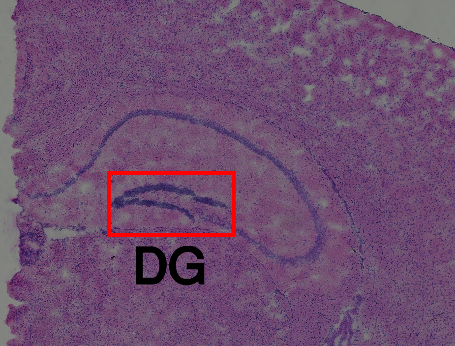

# Lab4 - Spatial Transcriptomics


## Introduction

Welcome to lab 4, where we will explore the field of Spatial Transcriptomics.
Many of the ideas that you encountered when working with single cell data will
be revistied but now with the advantage that we can visualize our results in the
real physical space (not just UMAP or tSNE space). 

The field of spatial transcriptomics has grown rapidly, and multiple techniques
to obtain information of spatial gene expression exists. Some examples are :
MERFISH, ISS, osmFISH, seqFISH, HDST, baristaSeq, Slide-seq, and GeoMx. We will
however be focusing on spatial data generated from the _Visium_ platform (sold
by 10x Genomics). Visium is the successor to the technique - somewhat
confusingly - named Spatial Transcriptomics (commonly referred to as ST).

ST was developed at SciLifeLab, and presented to the world in 2016 when the
publication _Visualization and analysis of gene expression in tissue sections by
spatial transcriptomics_  was published in the journal Science. In December
2018, 10x Genomics aquired the IP rights to the ST-technique, and launched the
Visium platform in late 2019.

Both ST and Visium utilize a solid array onto which oligonucleotides with
spatial barcodes have been printed at regularly spaced locations (spots). These
oligonucleotides all have a poly-T sequence, making them apt to capture mRNA's
by their poly-A tail. By reverse transcription, the barcodes of the
oligonucleotides will be embedded in cDNA synthesized from the captured mRNA's;
hence, we know at which mRNA that each transcript was captured. Once the cDNA
molecules are sequenced, we can backmap them to their spatial position - using
the barcodes - and by doing so obtain spatial gene expression information. The
"old" ST arrays had 1000 spots printed on the array, while the newer Visium
slides has 5000 spots.

One *key* fact that should be emphasized is how none of these methods (ST and
Visium) operate on a single cell level. The expression data associated with each
spot is really a mixture of contributions from multiple cells, not all
necessarliy from the same cell type.


## Configure Rmarkdown and load packages

We begin by configuring our `knitr` settings; in short what is happening is that
we set the default values for our code chunks - which will affect the behavior
and appearance of the knitted file.

```{r setup, include=FALSE}
knitr::opts_chunk$set(echo = TRUE,
                      eval=TRUE,
                      message = FALSE,
                      warning = FALSE)

```

```{r}
GRADE_MODE <- TRUE
```


Next, let us load some the libraries that we will use in this lab.

```{r, echo = FALE, eval = TRUE}
# This chunk will:
# 1. Check if a package is installed
# 2. Install the package if it's missing
# 3. load the package

load.pkgs <- c("SummarizedExperiment" = "cran",
               "Seurat" = "cran",
               "sctransform"="cran",
               "ggplot2"="cran",
               "png"="cran",
               "grid"="cran",
               "topicmodels"="cran",
               "gridExtra" = "cran",
               "tm" = "cran",
               "gridExtra" = "cran"
               )

installed.pkgs <- installed.packages()[,1]

for (pkg in names(load.pkgs) ) {
  if (!(pkg %in% installed.pkgs) ) {
    print(sprintf("Installing : %s",pkg))
    if (load.pkgs[pkg] == "cran") {
      install.packages(pkg)
    } else if (load.pkgs[pkg] == "bioc") {
          BiocManager::install(pkg)
    }
  }
  do.call("library",list(pkg))
}
```

## Loading Data

In this lab, we will be examining  _one_ section from the mouse brain (coronal).
10x - the company behind Visium - shares some "example" datasets on their
webpage, which is where this sample is taken from. As you might remember, the
expression data is only one component of the ST and Visium assays, we also have
an image of the very same (stained by Hematoxylin and Eosin) tissue section to
use as a reference or aid in our analysis. The HE-image for our data is shown
below.


Now when we know what our tissue looks like, let us continue with the expression
data. When downloaded from 10x website, the data is stored in either a `.mtx` or
`.h5` format, but to make things a bit easier these have been cast into the good
old `.tsv` format that you since long are familiar with. Just as in the single
cell lab, the data consists of a _count matrix_ with genes along one dimensions
and (important) *spots* along the other dimension. Run the next chunk  to load
the aforementioned count matrix, and also inspect it.


```{r}

DATA.PATH <- "data/mouse-brain.tsv.gz"
raw.data <- read.table(DATA.PATH,
                       header = T,
                       sep = '\t',
                       row.names = 1)
raw.data
```
So what do we have here? Well, obviously the columns
represent genes and thus the rows must represent our spots. If you now have a
look at the rownames, you will see how there are a lot of numbers in there. The
rownames actually follows a given pattern, being:
`[x-coordinate]x[y-coordinate]`. For example, for the first spot the
x-coordinate is `545.377` and the y-coordinate is `1766.777`.

The next thing we want to do is to extract these coordinates for each spot, and
store in a new dataframe (`spatial.data`). For this we will use the function
`strsplit` and `sapply`, if in doubt about what any of these functions actually
to, use the `?function_name` feature in R!

```{r}

# Extract x-coordinates
xcrd <- as.numeric(sapply(rownames(raw.data), function(x){strsplit(x,"x")[[1]][1]}))
# Extract y-coordinates
ycrd <- as.numeric(sapply(rownames(raw.data), function(x){strsplit(x,"x")[[1]][2]}))
# Create data frame
spatial.data <- data.frame(x = xcrd,
                           y = ycrd)

# set rownames
rownames(spatial.data) <- rownames(raw.data)

#inspect the data frame
spatial.data
```

We can easily check, that our strategy to obtain the spatial coordinates for
each spot worked. The x and y coordinates (columns) should correspond to their
respective rownames.

As a second sanity check, we may also plot the spots in 2D space and see wether
their arrangement looks like something we might expect (= agreeing with the
tissue structure). To do this, simply run the code below:


```{r}
g <- ggplot(data = spatial.data) +
  geom_point(mapping = aes(x = x, y = y),
             size = 0.8
             ) +
  theme_void() +
  theme(plot.margin = unit(c(0.05, 0.05, 0.05, 0.05), "npc"))+
  coord_fixed()

print(g)
```

If you scroll back to the image above, you can clearly see how the spots
resemble the tissue outlines. This is positive, at least we now know that our
data isn't a complete mess, i.e., so far so good. With these affirimations, we
may proceed to prepare the data (and ourselves) for some fun analysis. Similar
to what we did in the single cell lab, we will use the `Seurat` suite, hence the
next thing for us is to create a Seurat object.

*Q0*: Create a Seurat object named `se` using the `CreateSeuratObject` function with
the following parameters:

* counts - `t(raw.data)`
* meta.data - `spatial.data`
* project - `"MouseBrain"`
* assay - `spRNA`

_Comment1_ : We do `t(raw.data)` since the count data we loaded was stored with
samples as rows and genes as columns, which is the transpose (`t`) to the
`Seurat` convention.

_Comment2_ : Note how set the `spatial.data` as meta data in our Seurat object.
That gives us easy access to the coordinates.

```{r}
# Create the Seurat object se here

#se <- NA
se <- CreateSeuratObject(counts = t(raw.data),
                         meta.data = spatial.data,
                         project = "MouseBrain",
                         assay = "spRNA"
                         )
se
```

We can now remove the `raw.data` object, since we've transferred all of it's
information to the Seurat object. This will free up some memory from our
computers.

```{r}
remove(raw.data)
```


*Q1*: First Exercise! Answer the questions below:

* 1) How many spots do we have
* 2) How many genes do we have
* 3) What is the name of the `1306th gene

Give your answers below
```{r,eval = GRADE_MODE}

# Give the answers to the questions above
# by assigning the values (answers) to
# the variables ans1,ans2 and ans3

ans1 <- dim(se)[2]
ans2 <- dim(se)[1]
ans3 <- rownames(se)[1306]

cat(sprintf("No. Spots : %d \nNo genes: %d\n1306th gene : %s",ans1,ans2,ans3))

```

_Comment_ : It might be a good idea to save these values (number of spots and
genes), either write them down or store them in specific variables.

So far we plotted the spots and then compared them to tissue image, but
scrolling back and forth is tedious and cumbersome.. we can do better than that!
Thanks to the setup of the Visium platform, we the spots can (seamlessly) be
overlaid on the tissue. 

The code below will do exactly this - overlay the spots on the tissue - for you.
You do not have to pay too much attention to the code, but it has been annotated
to inform you of what is going on in case you are interested.

```{r, fig.width= 7, fig.height= 7}

# load image
img <- readPNG("data/image.png")

# make a raster object from the image
# this is needed to plot the image together with
# the data
img.grob <- rasterGrob(img,
                       width = unit(1, "npc"),
                       height = unit(1, "npc"),
                       interpolate = TRUE)

# create a ggplot object
g <- ggplot(data = se@meta.data) +
  # add the image as a background
  annotation_custom(img.grob,
                    xmin = -Inf,
                    xmax = Inf,
                    ymin = -Inf,
                    ymax = Inf) +
  # plot the spots 
  geom_point(mapping = aes(x = x, y = y),
             size = 0.7,
             color = "red") +
  # adjust x-axis scaling
  scale_x_continuous(limits = c(0, dim(img)[2]),
                     expand = c(0, 0)) +
  # adjust y-axis scaling 
  scale_y_continuous(limits = c(0, dim(img)[1]),
                     expand = c(0, 0)) +
  # remove uneccesary stuff (ticks and axes) from the plot
  theme_void() +
  # configure margin settings
  theme(plot.margin = unit(c(0.05, 0.05, 0.05, 0.05), "npc"))+
  # fix plot aspect ratio
  coord_fixed()

print(g)

```

Now look at that, what a beauty! The spots and tissue overlap perfectly. Now
when we know how to overlay or spots on our image, let's start with the fun
stuff!

The whole purpose of Visium is to associate gene expression to spatial
locations, i.e., each spot has an expression value for every gene. To see this
property in action, we will visualize the expression of gene called  _Wfs1_  (a
marker gene for pyramidial neurons). In short, this will be done by

1. create a vector called `color.vector` which holds the expression values of _Wfs1_ at each spot
2. plot the image as a background (same as before)
3. plot the spots **but** color them according the gene expression values of _Wfs1_ (using `color.vector`)


```{r}

# create vector holding expression values for Wfs1
color.vector <- as.numeric(se$spRNA["Wfs1",])
# create image grob
img.grob <- rasterGrob(img,
                       width = unit(1, "npc"),
                       height = unit(1, "npc"),
                       interpolate = TRUE)

# create ggplot object
g <- ggplot(data = se@meta.data) +
  # add image as background 
  annotation_custom(img.grob,
                    xmin = -Inf,
                    xmax = Inf,
                    ymin = -Inf,
                    ymax = Inf) +
  
  # add spots, color by expression
  geom_point(mapping = aes(x = x, y = y,
                           color = color.vector),
             pch = 20,
             alpha = 0.3
             ) +
  # choose color gradient for spots
  scale_color_gradient(low = "white",
                        high = "red"
                       ) +
  # set labels of plot
  labs(colour = "Expression Level",
       title = "Wfs1 expression"
       ) +
  
  # adjust x-axis scaling
  scale_x_continuous(limits = c(0, dim(img)[2]),
                     expand = c(0, 0)) +
  # adjust y-axis scaling
  scale_y_continuous(limits = c(0, dim(img)[1]),
                     expand = c(0, 0)) +
  # get rid of unnecessary stuff
  theme_void() +
  # add margins
  theme(plot.margin = unit(c(0.05, 0.05, 0.05, 0.05), "npc"))+
  # fix plot ratio
  coord_fixed()

print(g)

```

What you can see here is how the expression of _Wfs1_ is mainly confined to a
few distinct spatial regions. Perhaps the most prominent one is the upper one
(with a slight bend), these signals overlap very well with the CA1 ( _Cornu
Ammonis1_ ) region of the mouse brain. This observation tells us that maybe,
there are some pyramidal cells in the CA1? Actually that's a very well
established fact, from Wikipedia:

> The CA areas are all filled with densely packed Pyramidal cells similar to those found in the neocortex.
>
>`r tufte::quote_footer("--Wikipedia, Hippocampus anatomy")

so even if this isn't exactly breaking news, it is an example of the sort of
inferences one can make from the raw data itself.

Before we proceed, note how we have already used the "plot-spots-on-image"
procedure twice, and probably will do again. There is also quite a lot of code
involved everytime we do this, and we only make small changes to it (like
adjusting the color of our spots). To avoid loads of repetitive code and make
things easier for us, we will therfore define a function `spatial.plot` that
will take care of the plotting for us. This function will be designed to take
the following parameters:

* se - a Seurat object with coordiantes in the metadata
* img - [optional] an image (corrseponding to the se data)
* alpha - [optional] transparency of the spots
* size - [optional] spot size
* color.vector - [optional] a vector of length n_spots with values to color spots by
* plot.title - [optional] title of the plot
* legend.tile - [optional] title of legend
* color.type - [optional] if colors are continous values or categorical variables

Again, you don't have to spend tons of time on the code here, but give it a look
and see if you sort of understand the workflow.

```{r}

spatial.plot <- function(se,
                         img = NULL,
                         alpha = 1,
                         size = 1,
                         color.vector = NULL,
                         plot.title = "",
                         legend.title = "",
                         color.type = "continous"
                         ) {
  
  
  if (is.null(color.vector)) {
    color.vector <- "black"
  }
  
  g <- ggplot(data = se@meta.data )
  
  if (!(is.null(img))) {
    
     img.grob <- rasterGrob(img,
                       width = unit(1, "npc"),
                       height = unit(1, "npc"),
                       interpolate = TRUE)
     
     g <- g +  annotation_custom(img.grob,
                              xmin = -Inf,
                              xmax = Inf,
                              ymin = -Inf,
                              ymax = Inf) +
       
    scale_x_continuous(limits = c(0, dim(img)[2]),
                       expand = c(0, 0)) +
     
    scale_y_continuous(limits = c(0, dim(img)[1]),
                       expand = c(0, 0))
    
   }
           
  g <- g + geom_point(mapping = aes(x = x,
                                    y = y,
                                   color = color.vector),
                     pch = 20,
                     size = size,
                     alpha = alpha
                     )
  
  if (color.type == "categorical") {
      n_col = length(unique(color.vector))
      g <- g+ scale_colour_manual(values = rainbow(n_col))
      
  } else {
    g <- g+ scale_color_gradient(low = ifelse(is.null(img),"yellow","white"),
                                   high = "red"
                                  )
  }
  
  g <- g+       labs(colour = legend.title,
                title = plot.title
                ) +
    
    theme_void() +
    theme(plot.margin = unit(c(0.05, 0.05, 0.05, 0.05), "npc"))+
    coord_fixed()
  
  return(g)
}

```

Of course, we now want to tryout our new function. We use `spatial.plot` to
create the same plot as before, using the `color.vector` (expression of _Wfs1_)
to color our spots.

```{r, fig.width= 5, fig.height=5}
gg <- spatial.plot(se,
                   img = img,
                   color.vector = color.vector
                   )

print(gg)

```

As you can see, this is a bit more conveinient to use than typing ~50 lines of
code each time we want to plot something.

*Q2*: _One_ of the genes:

* Bbs1
* Penk
* Ap3b2
* Prox1
* Apoe

has a very localized expression pattern, it is mainly expressed in the region
called the _Dentate Gyrus_ (DG). Use the `spatial.plot` function to find out
which of them it is. As an answer to this question, plot that particular gene
using `spatial.plot`.

If your mouse brain anatomy is a bit rusty, the image below might help you to
identify where exactly the Dentate Gyrus (DG) is.




```{r,fig.width=5, fig.height=5}
# Plot the gene highly expressed in the DG here
# using the spatial.plot function

dg.gene <- "Prox1"
dg.c.vec <- se@assays$spRNA[dg.gene,] %>% as.numeric
gg <- spatial.plot(se,
                   img,
                   color.vector = dg.c.vec
                   )

print(gg)

```

Having crafted some tools and gained more undestanding of the data, we will now
move on to more exciting stuff!

## Data Pre-processing

Ehm.. so there is actually one more not-so-exciting thing left to do... some
pre-processing, which includes filtering and normalization. But we are almost
there!

Just as with the single cell data, we want to curate our data to make sure that
it's apt for the downstream analysis. The first step in this procedure is to
remove bad "spots" - these could for example be spots which  aren't covered by
the tissue (but still were - falsely - identified as such by the 10x software).

To get a better sense of what spots we should remove, we will look at the
histograms of the meta data `nCount_spRNA` and `nFeatures_spRNA`. The former
informs us of the total number of observed transcript in each spot, while the
latter is telling of how many _different_ genes that we observe in respective
spot.

```{r, fig.widht = 14, fig.height = 5}
# Plot histograms over nCounts_spRNA and nFeatures_spRNA

h1 <- ggplot(se@meta.data,
            aes(x = nCount_spRNA)) +
  geom_histogram(color = "black",
                 fill = "red",
                 alpha = 0.7
                 ) +
  geom_vline(xintercept = 7000,
             color = "black",
             linetype = "dashed"
             )+
  labs(title = "Histogram | Total Counts") +
  ylab("No. Spots") +
  xlab("No. Transcripts")


h2 <- ggplot(se@meta.data,
            aes(x = nFeature_spRNA)) +
  geom_histogram(color = "black",
                 fill = "blue"
                 )+
  geom_vline(xintercept = 1500,
             color = "black",
             linetype = "dashed"
             )+
  labs(title = "Histogram | Features") +
  ylab("No. Spots") +
  xlab("No. Features")

h <- h1 - h2
print(h)
```

Dashed black lines have been added at the values 7000 (`nCount_spRNA`) and 1500
(`nFeature_spRNA`), these are the limits which we will settle on.

*Q3*: Create a vector named `keep.spots` which contains the _names_ of all spots
with **both** of the following criteria satisified:

1. `nCount_spRNA` should be larger or equal to $7000$
2. `nFeature_spRNA` should be larger or equal to $1500$

_Comment_ : Do *not* make any changes to your Seurat object yet.

```{r}

crit1 <- se[[]]$nCount_spRNA >= 7000
crit2 <- se[[]]$nFeature_spRNA >= 1500

keep.spots <- colnames(se)[crit1 & crit2]

```

Naturally, the next step is to identify which genes we want to keep and discard.
To guide us in the procedure we will plot histograms of (i) the total number of
UMI's of each gene (taken over all spots) and (ii) the number of spots in which
a gene is observed. We use a `log10` transformation with a pseudocount of 1 for
(i), otherwise the histogram becomes very distorted.

```{r}

nCount.genes <- Matrix::rowSums(GetAssayData(se))
nCount.genes.log10 <- log10(nCount.genes +1)
nObs.genes <- Matrix::rowSums(GetAssayData(se) > 0)

gene.data <- data.frame(nCounts = nCount.genes.log10,
                        nObs = nObs.genes )

h3 <- ggplot(gene.data,
            aes(x = nCounts)) +
  
  geom_histogram(color = "black",
                 fill = "lightblue"
                 )+
  
  labs(title = "i) Total Expression") +
  ylab("No. Genes") +
  xlab("Total UMI ")


h4 <- ggplot(gene.data,
            aes(x = nObs)) +
  geom_histogram(color = "black",
                 fill = "pink",
                 binwidth = 50
                 )+

  labs(title = "ii) Prevalence") +
  ylab("No. Genes") +
  xlab("No. Spots")

h <- h3 + h4

print(h)
```

We will apply a fairly stringent filtering; create an additional vector named
`keep.genes` with the **names** of the genes that satisfy both the following
criteria:

1. Total expression across all spots is larger or equal to $300$
2. The gene should be observed in _at least_ 5 spots

_Comment_ : do **not** make any modifications to your Seurat object yet

```{r}

crit1 <- nCount.genes >= log10(300)
crit2 <- nObs.genes >= 5

keep.genes <- rownames(se)[crit1 & crit2]

```


We will actually add one more layer of filtering to our genes; namely that
*mitochondrial* (MT) and *ribosomal* (RP) genes will also be removed. These
usually have a very dominant and sort of spurious expression profile, while
being of little interest to our biological questions. Run the code chunk below
to ensure MT and RP genes are excluded.

```{r}

keep.genes <- keep.genes[!(grepl("^(mt\\.|rp)",tolower(keep.genes)))]

```


**Q4**: Subset your Seurat object `se` using the vectors `keep.spots` and
`keep.genes`. The subsetted Seurat object should still be named `se` (i.e., you
should overwrite the old one )

```{r}
# enter code to subset your Seurat object here
se <- subset(se,
             features = keep.genes,
             cells = keep.spots )
se
```

**Q5**: Answer these to questions below:

1. How many genes were *removed*?
2. How many spots were *removed*?

```{r,eval = GRADE_MODE}

ans.q5.1 <- NA
ans.q5.2 <- NA

cat(sprintf("Removed genes : %s\nRemoved spots %s",ans.q5.1,ans.q5.2))

```

The final step before the actual analysis starts is to *Normalize* our data, the
motivation behind this has already been outlined in the Single Cell lab, so we
won't ponder upon it here - but rather just apply it. As in the
previous lab, the `SCTransform` function will be used for this purpose.

_Comment_: This might take some time, so don't worry if it's not done immediately!

```{r}
se <- SCTransform(se,
                  assay = "spRNA",
                  verbose = FALSE)
se
```

Sweet! We are now done with the pre-processing and can finally start analyzing
the data.

## Clustering

One good way to explore the inherent structure of our data is to cluster it,
this allows us to assess how our spots relate to each other and whether there
are any natural groupings contained in this data.

Clustering on the high dimensional data like ours, where each data point (spot)
has more than $18000$ features, is usually a bad idea. Most clustering
algorithms use distances between data points to find the clusters, but as the
number of dimensions grow, objects more or less become equidistant from each
other. Thus the algorithms render poor results. This phenomena is known as the
"curse of dimensionality".

In an attempt to avoid this curse we will therfore apply PCA (Principal
Component Analysis) to our data before clustering (using `RunPCA`). For purposes
of visualization we also use UMAP (Uniform Manifold Approximation and
Projection), this is done with the help of `RunUMAP`.

For the actual clustering we use the two functions `FindNeighbors` and
`FindClusters`. The former constructs a _SNN_ ( Shared Nearest Neighbor) graph
which is used by the latter to actually identify the clusters.


```{r}

se <- RunPCA(se,verbose = FALSE)
se <- RunUMAP(se,
              dims = 1:30,
              verbose = FALSE,
              seed.use = 1337
              )

se <- FindNeighbors(se,
                    dims = 1:30,
                    verbose = FALSE)

se <- FindClusters(se,
                   verbose = FALSE,
                   resolution = 0.5,
                   random.seed = 1337
                   )

se
```

To visualize the results in UMAP-space, we may use the `DimPlot` function.

```{r}
n_clusters = length(unique(se[[]]$SCT_snn_res.0.5))

DimPlot(se,label = TRUE,
        cols = rainbow(n_clusters))
```

So far this is very similar to what we did with the single cell data, but what
is really cool here is that we can see how these clusters are arranged in _the
real physical space_. In order to do so, We use our `spatial.plot` function to
color the spots by their cluster identity.

_Comment_ : The cluster identities are stored in the metadata slot as
`SCT_snn_res.resolution`, where `resolution` is equal to the parameter value
used in `ClusterData`.

_Comment_ : Since we are plotting labels (cluster identity) and not expression
values, we set the `color.type` parameter of `spatial.plot` to `categorical`.

```{r}
gg <- spatial.plot(se,
                   img = img,
                   color.vector = se[[]]$SCT_snn_res.0.5,
                   color.type = "categorical"
                   )
print(gg)
```
Take a moment to appreciate this, from the few lines of code that constitute our
simple analysis of the gene expression data, we manage to capture real
anatomical structures that would have taken years of research to define just 20
years ago. Pretty awesome, right?

But we are not done yet, now when we have these clusters to work with, the next
step is to characterize them. One way of doing that is to conduct a DGE
(Differential Gene Expression) analysis. 

```{r}

de.markers <- FindAllMarkers(se,
                             assay = "SCT",
                             logfc.threshold = 1,
                             verbose = FALSE,
                             only.pos = TRUE
                             )

de.markers

```
As a sort of sanity check, let us assess whether the marker genes' expression
overlap with the actual clusters they are supposed to represent. For a quick
assessment, let us plot _one_ marker gene associated with each cluster using the
`spatial.plot` function.

```{r,fig.width = 12, fig.height=9}

de.markers.one <- de.markers[!duplicated(de.markers$cluster),]

plot.list <- list()

for (gene in de.markers.one$gene) {
  expression.vector <- as.numeric(GetAssayData(se)[gene,])
  cluster.id <- de.markers.one[gene,"cluster"]
    
  plot.title <- sprintf("Cluster %d | Gene : %s",cluster.id,gene)
  plot.list[[gene]] <- spatial.plot(se,
                                    plot.title = plot.title,
                                    color.vector = expression.vector
                                    )
  
}

p <- grid.arrange(grobs = plot.list,
                  ncol = 4)
print(p)

```


## Factor Analysis

When clustering our spots, we will group together spots with similar expression
profiles (they reside near each other in gene expression space). But remember
how we in the introduction mentioned that each spot's expression profile is a
mixture of contributions from multiple cells. Thus, it is sometimes more
interesting to know what the constituents of these mixtures are and how they are
distributed within the data.

To approach this question, we can consider each spot as a combination of some
latent - unobserved - factors. These factors, depending on how we design the
model, could represent transcription programs or alternatively cell types. In
contrast to a spot being assigned to a single cluster, it is defined by the
composition of different contributions from respective factor. The process of
retrieving and characterizing these factors, might be referred to as a form of
**decomposition** or **factorization**.

Such factors can be learned from the data, but also defined _a priori_; a good
example of the latter is when single cell data is integrated with spatial data
(next section) - we can then consider the cell types associated expression
profiles as latent factors. However, for now, we will focus on the case when we
do not know the character of our factors prior to the analysis.

There is a plethora of different methods to conduct factor analysis or modeling
of similar problems, some of them designed specifically with gene expression
data in mind. Since more complex models tends to take longer time to fit and
converge, we will use a relatively simple form of factorization called Latent
Dirichlet Allocation (LDA) - borrowed from the field of topic modelling.

LDA was first presented in 2003 (Blei et al.), the original problem it
was designed to solve can be described as: 

> "Given a corpus of 𝑀 documents, with a vocabulary consisting of 𝑉 words,
assume each document can be assigned to one or more of 𝑇 topics. Each topic 𝑡
is characterized by its frequency distribution over the 𝑉 words. How are the
words distributed across the topics and how are the topics distributed across
the documents?"

If we consider this in the context of spatial transcriptomics, we can see how an
alternative formulation could be stated as :

> "Given a section with 𝑆 spots, with a total of 𝐺 genes being expressed
across all spots, assume each spot can be assigned to one or more of 𝑃
expression programs. Each program 𝑝 is characterized by its frequency
distribution over the 𝐺 genes. How are the genes distributed across the
expression programs and how are the programs distributed across the spots?"

Despite being described as "simpler", the LDA model takes a fairly long time to fit and
scales poorly with the number of genes, therefore we will only use the top 5000
highest expressed genes (based on the raw, not normalized data).

_Q6_:  Create a vector named `top.5000` that contains the names of the top 5000
genes w.r.t. total gene expression.

_Comment_: You want to use the assay "spRNA" and not "SCT" for this

```{r,eval = GRADE_MODE}
# create the vector top.5000 here
top.5000 <- order(Matrix::rowSums(GetAssayData(se,assay ="spRNA")),
                  decreasing = TRUE)[1:5000]

top.5000 <- rownames(se)[top.5000]

```

The next code chunk provides code that convert the data into a suitable format
for the LDA implementation to use, and then fits the model. It uses $10$
topics, this number is chosen quite arbitrarily.

Now, you can have a look at the code below but  *DO NOT RUN IT*. The fitting
procedure will take about 1 hour on a good computer, so to avoid you wasting
valuable time on a slow algo - skip ahead to the next code chunk where you can
load an already fitted model (using the code in this chunk).

```{r, eval = FALSE}
# DO NOT RUN

# Code to prepare data for the LDA algorithm
# and the actual fitting of the model

tdm <- as.TermDocumentMatrix(GetAssayData(subset(se,features = top.5000),
                                          assay = "spRNA"),
                             weighting = "weightTf"
                             )
tdm <- weightTf(tdm)

dtm <- as.DocumentTermMatrix(tdm)


                              
lda.res <- LDA(dtm,
               k = 10)


```

Run the code chunk below to load a fitted model

```{r}
# load an already fitted model
lda.res <- readRDS("data/lda-res.Rds")
```

So the model has now been fitted with $10$ topics (gene expression programs). In
contrast to the clustering - where each spot has one label (cluster id) - they
now have a value for every topic representing the *proportion of genes* in transcriptot
th
a spot that originates from respective topic. These proportion values are found
in the ot of the `lda.res` object.

To see how the topics are spread across our spots, we use `spatial.plop`lot the
trrto visualize tion value


```{r,  spatially.fig.width=12, fig.height=10}

plot.list <- list()

for (topic in 1:10) {
  plot.list[[topic]] <- spatial.plot(se,
                                     color.vector = lda.res@gamma[,topic],
                                     plot.title = paste("Topic",topic),
                                     legend.title = "proportion"
  )
}
  

g <- grid.arrange(grobs = plot.list,
                  ncol = 4)
print(g)


```

**Q7**: Compute the rowsums of the `gamma` slot in `lda.res`, inspect your result and answer the following questions:

1. The rowsums are all identical, what is the value that all sums othey all share are all the rowsums identical?

Give your answers as comments in the code chunk below, they should be short and concise, 
ot more tha a sentence or two.

```{r}
# Answers to Question 7

# Question 7.1
#
#

# Question 7.2
#
#

```


Now what's even neater with LDA is that in addition to topic distribution among
spots, it also fits the word (gene) distribution among topics. Meaning that we
can see which genes that are very frequent (and thus charateristic) of each
topic. More precisly the `beta` slot of our `lda.res` object holds the logged
probabilities of a word being sampled from a specific topic.

Topic 9 - concentrated to the CA 1-3 regions and the dentate gyrus - looks sort
of interesting, let us therefore see what $50$ genes that are most strongly
associated with this topic.

```{r}

top.topic.9 <- order(lda.res@beta[9,],decreasing = T)[1:100]

top.topic.9 <- data.frame(gene = lda.res@terms[top.topic.9],
                             prob = exp(lda.res@beta[9,top.topic.9])
                             )

print(top.topic.9)

```

If you were to run a pathway/enrichment analysis on this set of genes (i.e.,
looking what sort of biological functions and pathways that it can be
associated with), we'd see terms like "synapses","cell junctions","dendritic
spine", "proton transmembrane transporter activity", etc. This makes sense
since the regions Topic 9 is most dominant in are heavily involved in the
formation and retreival of new memories as well as processing of neuronal
signals.

*Q8* Create a data frame called `top.2.genes` with the *top 2* genes of each
topic. This data frame should have the columns: "gene","prob" and "topic",
containing the following information:

* gene - name of the gene
* prob - probability of being sampled from the asssociated topic
* topic - the topic to which the gene is associated

_Hint 1_: the names of the genes can be accessed by `lda.res@terms`. As you saw
in the code chunk above.

_Hint 2_: It might be a good idea to use a for loop here! However, it's not a
must, there are multiple ways of solving this exercise!

_Hint 3_: If you want append an element to a vector, you simply do 
`my.vector <- c(my.vector,new.element)`

```{r}

n.topics <- 10
prob.vec <- c()
gene.vec <- c()
topic.vec <- c()

for (topic in 1:n.topics){
  pos <- order(lda.res@beta[topic,],decreasing =T )[2]
  gene.vec <- c(gene.vec,lda.res@terms[pos])
  prob.vec <- c(prob.vec,exp(lda.res@beta[topic,pos]))
  topic.vec <- c(topic.vec,rep(topic,2))
}

top.2 <- data.frame(gene = gene.vec,
                    prob = prob.vec,
                    topic = topic.vec)

print(top.2)

```

## Single Cell Integration

The idea of factor decompisition is attractive, but there are still some
challenges to this approach. The factors (what we referred to as topics before,
factor is a more general term), do not necessarily represent specific cell types
and we have no immediate biological interpretation of them.

What if we wanted to where a specific type of Neurons or Astrocytes (common cell
types in the brain) are located in our spatial data; then we would have to hope
that some of our factors correspond to these types (which there is no guarantee
of) and then try to figure out which factors that would be. Not the most robust
approach, right?

A solution this problem is to use a form of guided factor decomposition, where
we already know our factors but are interested how they are distributed across
the spots. In the case of localizing cell types, these factors would be
expression profiles from each individual cell type that we are interested in.
But from where would be obtain such information? The answer comes in the form of
a different type of data, namely _single cell RNA-seq_. 

In single cell experiments, each data point corresponds to one individual cell
(once duoublets have been removed). This means that if we assign an identity
(e.g., cell type or cluster), we can learn the expresion profiles and then
deconvolve our spatial data with them.

Multiple strategies exists to "map" single cell information onto the spatial
data, but we will use output from a tool called `stereoscope`
(from the paper _"single-cell and spatial transcriptomics enables probabilistic inference of cell type topography"_ 
in Nature Communications Biology). In short this method models both single cell
and spatial data as _Negative Binomial_ (NB) distributed, for every gene infers
the paramters of each cell type's distribution, then finds the optimal
combination of cell types in each spot based on Maximum a Posteriori estimation.

To map cell types from single cell data onto the tissue, we need a good single
cell data set which is at least _somewhat similar_ to our spatial data, i.e.
where we expect the same set of cell types to be present. 

Fortunately for us, there is a website called `mousebrain.org` where *a lot* of
single cell data from the mouse brain is avialable. One of the single cell data
sets (from the hippocampal region) is visualized (in gTSNE-space, similar to our
UMAP-embedings). In the letter+number combinations, the letter indicate which cell
type identity of the cluster while the number indicate different subtypes of the
broader cell type classes. The letters symbolize:

* N - Neurons
* A - Astrocytes 
* V - Vascular cells
* I - Immune cells
* O - Oligodendrocytes
* Ep - Ependymal cells
* Ex - Excluded from single cell study


Now `stereoscope` is a probabilistic model that takes quite a lot of time to
fit, and you usually need GPU resources for it to run in reasonable time. Therefore you will load the output of `stereoscope` when applying it to the aforemention single cell data set and the section

```{r}

stsc <- read.table("data/stereoscope-results.tsv",sep = '\t',row.names = 1, header = 1)
stsc <- t(stsc)

se[["stereoscope"]] <- CreateAssayObject(counts = stsc)

DefaultAssay(se) <- "stereoscope"
GetAssayData(se)[1:5,1:5]

```

The cell types present in our data are

```{r}

cat(paste(rownames(se), collapse = ", "))

```

Now how about having a look at how the celltypes:

* Ependymal-47
* Neurons-27
* Neurons-59

our beloved `spatial.plot` comes in handy again

```{r}

plot.types <- c("Ependymal-47","Neurons-27","Neurons-59")
plot.list <- list()

for (cell.type in plot.types){
  color.vector <- GetAssayData(se)[cell.type,]
  plot.list[[cell.type]] <- spatial.plot(se,
                            color.vector = color.vector,
                            plot.title = cell.type,
                            legend.title = "proportion"
                            )
  
}

g <- grid.arrange(grobs = plot.list,
                  ncol = 3)
print(g)

```

So now we know how these 3 cell types localize in the tissue, but with 56 types
in total it can be a bit hard get a comprehensive overview of all the types.
Especially if we want to start assess paterns of interaction and
co-localization, which is often of great interest to know. To exemplify, if we
were to plot every pair of cell types in order to see if they had similar
spatial distributions, we have to look through $56!/(54!2!) = 1540$ pairs...
which is in the upper bounds of "quite a lot".

In order to condense the rich information that the single cell mapping has given
us, we can instead look at the (Pearson) correlation of the proportion values
between different cell types. This will tell us which cell types that have
similar spatial distributions (co-localizing) as well as which types that tend
to populate different regions.

We will compute these correlation values - cast as a correlation matrix - and
then visualize them in a heatmap.


```{r, fig.width=10,fig.height=10}

color.pal <- rev(colorRampPalette(brewer.pal(11,"RdBu"))(nrow(se)))
cors <- cors <- GetAssayData(se) %>%
  as.matrix() %>%
  t() %>% 
  cor()

diag(cors) <- NA

hm <- heatmap(cors,
              col = color.pal,
              scale = "none",
              verbose = F,
              breaks=seq(-1, 1, length.out=length(color.pal) +1)
              )

print(hm)

```


From this we can see that the celltypes "Neurons-10" and "Neurons-15" seem to
have a high degree of co-localization, among many other pairs. To assess whether
this makes sense we can plot their spatial distribution using `spatial.plot`.

*Q9*: Plot the spatial distribution of the two cell types "Neurons-10" and
"Neurons-15", like we did for the cell types "Ependymal-47", "Neurons-27" and
"Neurons-59"; you are welcome to take inspiration from the code used before.

```{r,eval =GRADE_MODE}

# Write the code to plot the spatial distribution of
# the cell types Neurons-10 and Neurons-15 here

plot.types <- c("Neurons-15","Neurons-10")
plot.list <- list()

for (cell.type in plot.types){
  color.vector <- GetAssayData(se)[cell.type,]
  plot.list[[cell.type]] <- spatial.plot(se,
                            color.vector = color.vector,
                            plot.title = cell.type,
                            legend.title = "proportion",
                            size = 1
                            )
  
}

g <- grid.arrange(grobs = plot.list,
                  ncol = 2)
print(g)
```


## Hand In Guidelines

**How :**  First, go to the top of this document and set
`GRADE_MODE = TRUE`. Next, knit this document, and hand in the resulting html-file
on Canvas. Make sure you have solved all the questions. If the document doesn't
compile, there is something wrong with the code.

**Deadline**: Your report is due 23:59 one week after the scheduled lab session;
if working in pairs - each of you should hand in two (identical) reports where the
names of both authors are clearly stated. For further information see the
guidelines on the course web-page.

